# Agentic AI 推理机头 CPU 综述：从 Host 到 Orchestrator

> **更新日期：** 2026-05-17
> **刷新内容：** 修正 DeepSeek V4/Engram 关系；新增 Agent Team/Swarm 对机头 CPU 影响的系统级研究（Hive、RelayCaching、AMPD、KAIROS、Claude Code 架构分析、PolyKV、AMD CPU:GPU 1:1）
> **资料时间边界：** 2025-07-01 及之后公开发表的论文、专利、产品发布与产业分析
> **范围：** 聚焦 GPU 推理节点上的 host CPU / control-plane CPU（"机头 CPU"），不讨论训练场景；工具执行本身的 CPU 消耗仅在必要时作为背景。
## 摘要

Agentic AI 正在将推理系统的关键瓶颈从 GPU 计算逐步外溢到 host 侧编排链路。基于 2025 年下半年以来的 40 余份公开论文、厂商技术文档与产业分析（含 2026-04-24 发布的 DeepSeek V4 技术报告），本文系统综述了机头 CPU 在 agentic AI 推理中的角色演化与系统影响。现有证据表明，机头 CPU 的核心功能已从传统 host 演化为 **inference orchestration layer**：其职责不再局限于 kernel launch，而扩展到请求接入、prefill/decode 切分、KV 保留与预取、跨节点传输、专家放置、多代理并发控制及跨 Agent KV 共享协调等多个方面。

为什么这一转变会在 2025–2026 年集中爆发？本文识别出四条相互耦合的技术主线，它们并非独立演进，而是在 agentic workload 的催化下形成了正反馈：

1. **算子下发与状态驱动调度**：权重量化越激进，"调度墙"越明显。一个 135M 参数的 IQ4 量化模型单次前向传播发射 301 个 Kernel，纯下发税达 **750 μs**（占单 Token 时间的 **95%**）；CPU oversubscription 可使 dequeue 延迟放大 **19×**。vLLM V1 通过 Persistent Batch 等重构将吞吐提升 **1.7×**。
2. **KV 卸载与生命周期管理**：agentic 推理 cache hit 达 **85%–97%**，read/write ratio 高达 **11.7x**；CPU 内存已从 spill 层升级为 warm tier。DeepSeek V4 的 CSA/HCA 混合注意力将 1M token 上下文 KV cache 降至 V3.2 的 **10%**；Engram 条件记忆将 100B 参数静态知识表完全卸载到 Host DRAM，吞吐损失仅 **<3%**；NOSA 实现 **5.04×** 解码吞吐提升，CXL 内存扩展可将 GPU 需求降低 **87%**。
3. **MoE 推理与专家编排**：专家权重卸载使 CPU 成为路由与通信编排器。DeepSeek V4 的 1.6T MoE 仅激活 49B 参数，但冷专家命中会触发同步 CPU→GPU 拷贝；Speculating Experts 推测预取可将 TPOT 降低 **14%**，FineMoE 通过 expert map 相似性搜索实现细粒度预取，SpecMoEOff 结合 speculative decoding 实现 **2.5×** decode 吞吐提升。
4. **PD 分离与跨池编排**：PD 分离已成为生产默认架构；跨节点 KV 传输需 **90 Gbps+** 带宽。Agentic batch inference 引入 **middle-phase thrashing** 问题——异步推进的 agent 其暂时不活跃的 KV 被 LRU 驱逐，恢复时需反复重算或传输。

与此同时，**Agent Team/Swarm** 的兴起进一步重塑了机头 CPU 的负载特征。Kimi Agent Swarm 支持 **100 并行 sub-agents**，单次任务触发 **>1,500 次工具调用**；Claude Code Agent Teams 消耗 **7×** 标准会话的 token，其架构分析揭示 AI 决策逻辑仅占 **1.6%**，运营基础设施占 **98.4%**。系统级研究证实：RelayCaching 实现跨 Agent **>80%** KV cache 重用、TTFT 降低 **4.7×**；Hive 的 Agent-Aware Scheduling 降低热点 miss rate **33%–51%**；AMPD 将多轮 PD 分离的 SLO attainment 提升 **67%–967%**；KAIROS 发现 Agentic inference 功耗比单轮高 **2–3 个数量级**。

真实 agentic 产品形态暴露出传统 serving 论文容易忽略的四项 CPU 需求：**高频 prefill 调度、多上下文并存管理、极宽 fan-out/fan-in burst handling、跨 Agent KV 共享协调**。NVIDIA Vera CPU（88 核 / 1.2 TB/s LPDDR5X）、BlueField-4 STX/ICMSP（5x token 吞吐）、CXL 内存扩展等平台信号说明，硬件路线图正在围绕"CPU 作为 AI factory 控制平面"收敛。AMD 官方进一步确认，CPU:GPU 配比正从 1:4–1:8 转向 **1:1**。Morgan Stanley 预测 DRAM 将取代 HBM 成为 AI 基础设施最紧缺的芯片瓶颈，DDR5 价格 2026 Q2 预计上涨 **50%+**。

**关键词：** Agentic AI；LLM inference；host CPU；operator dispatch；KV cache offloading；Mixture of Experts；prefill-decode disaggregation；multi-agent inference
## 1. 引言：Agentic AI 如何重新定义系统瓶颈

近两年，大模型推理系统的优化重点经历了显著迁移。早期工作主要关注 GPU 侧的算力利用率、注意力算子实现和显存容量边界；而在 agentic AI 兴起之后，系统行为从"单次请求、连续 decode"转向"多阶段推理、状态保留、外部中断、上下文复用与多代理并发"的复合执行模式。这一转变并非渐进式改良，而是从根本上改变了系统瓶颈的空间分布——**瓶颈正在从 GPU 内部外溢到 host 侧编排链路**。

### 1.1 为什么瓶颈会外溢：GPU 效率提升的副作用

一个反直觉的事实是：GPU 越高效，CPU 越容易成为瓶颈。Georgia Tech 与 Intel 的联合研究（2025-11）表明，典型 agentic 工作负载中工具处理占端到端延迟的 **50%–90.6%**；GPU 升级越快，瓶颈越迅速向 CPU 侧转移 [1]。这不是因为 CPU 变弱了，而是因为 GPU 的计算速度提升超过了 host 侧编排速度的提升，导致两者之间出现了越来越大的"能力鸿沟"。

DeepSeek V4（2026-04-24 发布）的架构设计从另一个角度验证了这一趋势。V4 放弃了从 V2 到 V3 使用的 MLA，重回 **MQA**，并引入 **CSA（4× 序列压缩）+ HCA（128× 序列压缩）** 沿序列维度压缩 KV Cache [30]。与此同时，DeepSeek 独立推进的 **Engram** 条件记忆研究线（arXiv:2601.07372）通过 N-gram hash 实现 O(1) 静态知识检索，可将 **100B 参数**的嵌入表完全卸载到 Host DRAM，吞吐损失仅 **<3%** [31]。虽然 V4 技术报告全文未提及 Engram（两者是并行研究线），但这两条路线共同指向同一趋势：**CPU 侧不再是 GPU 的被动跟随者，而是与 GPU 并列的、承担不同职责的计算层**。

Kimi Agent Swarm（2026-04）则从产品形态上验证了并发宽度的爆炸：支持 **100 并行 sub-agents**，单次任务触发 **>1,500 次工具调用** [39]。这种瞬时 fan-out 将 CPU 从"单会话调度器"推向了"多租户并发编排器"。

### 1.2 四条技术主线的同时收敛

现有材料可以归纳为四条同时收敛的技术主线，任何一条都足以单独抬高 CPU 地位，而 agentic workload 让它们同时出现：

**算子下发从"发命令"变成"编排状态机"**。传统 serving 假设请求是"单上下文、长 decode、稳定批次"，但 agentic inference 表现为 prefill → decode → 暂停 → 恢复 → 分叉 → 合并的复合执行模式。每个阶段切换都需要 host CPU 做 request state transition、worker affinity 决策、KV object 生命周期跟踪。权重量化越激进（IQ4/FP4），模型越小，Batch 内可容纳的请求越多，Kernel 发射频率越高，CPU 调度负载反而越重。

**KV 卸载从"容量兜底"变成"生命周期管理"**。NVIDIA Dynamo 数据显示 agentic inference cache hit 可达 **85%–97%**，read/write ratio 高达 **11.7x** [9]。系统价值重心从"写新 KV"转向"保留、路由、预取和恢复旧 KV"，CPU 内存已从 spill 层升级为 warm tier。DeepSeek V4 的 CSA/HCA 将 KV cache 降至 V3.2 的 **10%** [30]，Engram 则将静态知识从注意力中剥离 [31]。RelayCaching（arXiv:2603.13289）进一步证明，在多 Agent 流水线中跨 Agent **>80%** 的 KV cache 可直接重用 [36]。

**MoE 从"稀疏计算优势"变成"host-side orchestration 压力"**。DeepSeek V4（1.6T 总参 / 49B 激活参）单节点无法容纳全部专家，冷专家命中会触发同步 CPU→GPU 拷贝。CPU 承担权重搬运、路由协调和拓扑感知负载均衡三重职责。2026 年的 FineMoE [31]、SpecMoEOff [32] 等系统进一步证明，专家预取的准确率直接决定系统吞吐。

**PD 分离把 CPU 从"单节点调度器"升级为"跨池编排中枢"**。Hao AI Lab 2025-11 回顾确认 PD 分离已成为"几乎每个主要 LLM 服务栈的默认手册"。机头 CPU 需要管理跨节点 KV Cache 传输（同节点 <0.1% 开销，跨节点需 **90 Gbps+**）、序列化/反序列化以及预填充池与解码池的动态负载均衡。AMPD（arXiv:2602.14516）进一步证明，在多轮 Agentic 工作负载中，**13.9%–31.7%** 的增量 prefill 应留在 decode worker 本地执行，避免远程 KV 传输 [40]。Agentic batch inference 还引入了 **middle-phase thrashing** 问题——异步推进的 agent 其暂时不活跃的 KV 被 LRU 驱逐，恢复时需反复重算或传输 [33]。

### 1.3 核心数据信号

NVIDIA 2026 年 4 月的 Dynamo agentic inference 数据显示，在 agentic workload 中，后续调用的 cache hit 可达 **85%–97%**，4 个 teammate agent 聚合后可到 **97.2%**，累计 **read/write ratio 为 11.7x** [9]。这意味着系统的价值重心从"多写一点新 KV"转到"把旧状态留住、路由对、提前取回、避免重算"。

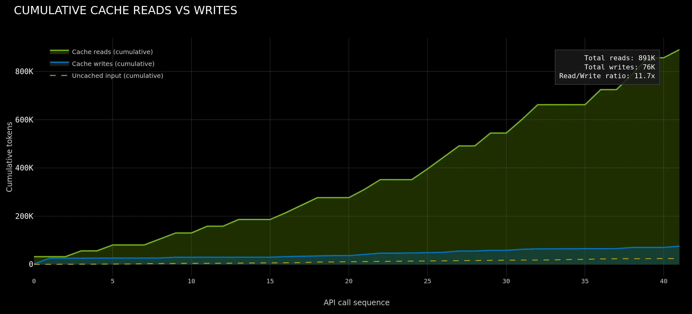

**图1** Agentic inference 的 KV 读写关系。累计读取明显快于累计写入，说明 agentic workload 的核心压力正从"持续写入新状态"转向"保留、路由、预取与恢复既有状态"。来源：NVIDIA, 2026-04-17 [9]。

本文基于现有报告、图表与引用材料，结合 DeepSeek V4 技术报告、Engram 条件记忆论文、Agent Team/Swarm 系统研究以及 2026 年最新研究成果，将现有研究归纳为上述四条相互耦合的技术主线，并结合真实产品工作负载与平台演化信号，对机头 CPU 的角色、瓶颈与选型做出系统性判断。
## 2. 主线一：算子下发——控制路径密度取代内存带宽成为瓶颈

本章聚焦机头 CPU 在算子下发环节中的角色演化。核心判断是：**瓶颈正从"GPU 算得够不够快"转向"host 侧控制动作够不够少、够不够连续"**。现有文献已直接证实了两件事：第一，kernel launch 本身在小模型场景已可占单 token 时间的 **95%**；第二，在传统 serving 中，host 侧 HTTP 服务 + 调度/输入准备已占端到端时间的 **62%**。agentic 场景则通过引入频繁的 stage transition（工具调用、暂停恢复、subagent 分叉），进一步推高了**单位 GPU 计算量所对应的 host 控制动作数（control-path density）**。

需要预先声明的是：现有文献对"agentic 场景下每次状态切换具体消耗多少 host CPU 周期"这一问题尚未给出精确答案，但已有论文直接量化了其宏观效应（scheduling bubbles 占 **58.2%** 总延迟）。本章将明确区分"直接测量的证据"与"基于系统架构的合理推断"。

### 2.1 调度墙取代内存墙：kernel launch 开销的直接测量

2026 年 3 月，ai.rs 发表了一项针对小模型推理的深度工程实测，直接揭示了当内存墙消失后什么会成为下一个瓶颈 [3]。实验在 RTX 5090（Blackwell）上进行，使用 135M 参数的 SmolLM2 量化模型（IQ4_NL/IQ4_XS，权重池 85 MB，完全驻留 L2 Cache）。

**直接测量结果**：单次前向传播发射 **301 个 kernel**，每个 launch 约 **2.5 µs**，纯下发税累计 **750 µs**，而单 token 总时间仅 **792 µs**——launch overhead 占 **95%**。通过 kernel fusion 将发射数降至 181 次后，吞吐从 1255 tok/s 提升到 1508 tok/s（**+20%**）。作者明确总结："The memory wall was gone. The dispatch wall had replaced it." [3]

Event Tensor 论文（MLSys 2026）从编译器角度提供了另一组直接测量：当前 GPU 调度模型中，**每个 kernel launch 典型延迟为 5–10 µs**，而最快的 kernel 可能仅 2 µs 就完成——launch 开销已超过计算本身 [4]。

这些数字的含义不是"launch 很慢"，而是：**当 GPU 计算本体被压缩（量化、小模型）后，host 侧固定税费就会立刻浮出水面**。量化降低显存压力 → 模型更小 → Batch 内可容纳更多请求 → kernel 发射频率更高 → CPU 调度负载更重。LongCat-Flash-Lite（2026-01）同样观察到，在轻量模型 + 大有效 Batch Size 场景下，瓶颈从内存带宽转向 Kernel Launch Overhead [21]。

DeepSeek V4 的 FP4 量化感知训练进一步将这一趋势推向极致：expert 权重和 indexer QK 路径在预训练阶段即使用 FP4，使单 token 推理 FLOPs 降至 V3.2 的 **27%** [30]。FLOPs 的急剧下降意味着，即使 launch 开销绝对值不变，其在端到端时间中的占比也会大幅上升——当 GPU 计算时间从 10 ms 降至 2 ms 时，同样的 750 µs 下发税就从 7.5% 变成了 37.5%。

### 2.2 Host 侧非计算开销已占主导：端到端时间分解的直接证据

《Characterizing CPU-Induced Slowdowns in Multi-GPU LLM Inference》（2026-03）提供了目前最系统的 host 侧时间分解 [2]：

- **HTTP 服务占 33%** 执行时间
- **调度 + 输入准备占 29%**
- **GPU 实际计算仅占 38%**

这是**直接测量**，而非推断。它说明在多 GPU serving 中，host 侧已经成为时间主导方。

该研究进一步量化了 CPU 竞争的放大效应：vLLM 的 `shm_broadcast.py` 广播队列在 5 req/s、100k token 输入、TP=4 场景下，dequeue 延迟从 12 ms 恶化到 **228 ms**（**19×**），是 GPU 单步解码时间（44 ms）的 5 倍以上。NCCL 集合通信中，若某一 Rank 的 CPU 被抢占 1 ms，所有 GPU 忙等放大为集群级停滞。

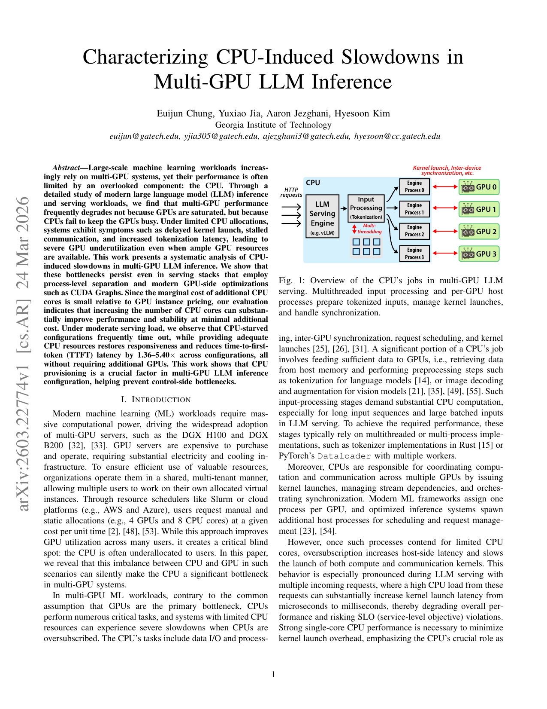

**图2** CPU 竞争对多 GPU LLM 推理的影响。实验显示 CPU oversubscription 可使 dequeue 延迟放大 19 倍，GPU 计算仅占端到端时间的 38%。来源：arXiv:2603.22774 [2]。

这一问题的严重性在于：它不会在 GPU 利用率监控上直接暴露。GPU 利用率指标可能显示 90%+，但那 90% 里包含了大量"有效计算被调度延迟打断后的碎片化执行"。真正需要关注的是**GPU 的有效计算密度**（useful FLOPs per wall-clock second），而非原始利用率。

### 2.3 Agentic 场景推高 control-path density：直接证据与推断的边界

传统 chat serving 更接近单条请求连续 decode：请求进入后经历"一次 prefill + 长连续 decode"，host 介入频率低，调度开销容易被计算时间摊平。Agentic inference 则频繁经历：prefill → decode → 外部工具调用 → 等待返回 → 恢复 → 可能分叉给多个 subagents → 聚合结果 → 继续生成。

**直接证据：Continuum 量化了 scheduling bubbles 的宏观代价**

Continuum（arXiv:2511.02230，2026-05）首次系统量化了这种多轮状态切换对调度的放大效应 [50]。该研究直接测量发现：传统推理引擎（vLLM/SGLang）将 decode 结束视为请求完成，立即驱逐 KV cache；当 tool 返回后，请求必须重新排队等待 GPU 内存，产生 **scheduling bubble**。由于每次 tool call 都会触发一次 bubble，多轮累积后 scheduling bubbles 可占 agentic 程序总延迟的 **58.2%**。即使启用 CPU offloading，返回后的请求仍需在等待队列中排队，per-turn queueing delay 随轮数线性增长。

这是现有文献中**最接近直接证据**的数据：它不等于"每次状态切换消耗多少 CPU cycle"，但直接证明了"频繁的 stage transition 会在系统层面产生巨大的调度空洞"。

**推断性证据：工程复杂度与架构设计间接指向 control-path 密度上升**

虽然"每次工具调用返回、subagent 分叉、session 恢复具体触发多少 host 控制动作"尚未被论文直接分解，但以下间接证据共同支撑了这一方向：

- **Claude Code 架构分析** [41]：对 300K+ 行 TypeScript 源码的静态分析显示，仅 **1.6%** 的代码量构成 AI 决策逻辑，剩余 **98.4%** 为 operational infrastructure（权限系统、上下文 compaction 管道、subagent 编排、session 持久化）。虽然代码量不等于运行时 CPU 时间，但这一比例从工程复杂度角度强烈暗示：host 侧的控制路径远比模型推理本身复杂。

- **NVIDIA Dynamo 的 router 设计** [9]：Dynamo 为处理 agentic 路由专门构建了 Flash Indexer（**170M ops/s** 的 KV 路由索引），并引入了 KV-aware placement、priority scheduling、extensible routing strategies 三层机制。NAT 团队在其上实现 Thompson Sampling bandit 路由后， measured **4× reduction in p50 TTFT**。这些工程投入本身即是对 control-path 复杂性的间接确认——如果路由决策 negligible，就不需要 planetary-scale 的索引和可扩展的策略框架。

- **RAJ 等人的工具延迟分解** [1]：在 SWE-Agent 中，Bash/Python 工具执行占端到端延迟的 **38–65%**；在 RAG 中，ENNS 检索占 **>75%**。这些数字说明 agentic workload 的 host 侧负载已经从"单纯的 kernel launch"扩展为"工具执行 + 编排 + 状态管理"的复合控制平面。

综合以上证据，可以形成以下**有边界的核心判断**：

> 现有文献已直接证明 kernel launch 和 host 调度在 LLM serving 中占主导地位 [2][3][4]，且 Continuum 直接量化了 agentic 多轮交互中 scheduling bubbles 可占 **58.2%** 的总延迟 [50]。agentic 场景通过引入频繁的 stage transition，进一步推高了单位 GPU 计算量对应的 host 控制动作数（control-path density）。虽然"每次状态切换的独立 CPU 开销"尚未被现有 profiling 研究精确分解，但 Claude Code 的代码结构（98.4% operational infrastructure）[41]、Dynamo 的 KV-aware routing 工程 [9] 以及 RAJ 等人的工具延迟数据 [1] 共同指向同一结论：**host 侧控制路径的密度和复杂度，正在成为 agentic AI 推理的结构性瓶颈**。

### 2.4 推理引擎层面的缓解路线

从现有研究与工程材料看，针对 control-path density 的有效路线主要有四类：

**Kernel fusion / megakernel**：减少发射次数与跨 kernel 边界同步。ai.rs 通过 fusion 将 301 次发射降至 181 次，吞吐提升 20% [3]；Event Tensor 通过编译器生成 persistent megakernel，在低 batch agentic 场景下比 vLLM 快 **1.48×**、比 SGLang 快 **1.20×**（Qwen3-30B-A3B，batch=1）[4]。

**Persistent batch / Python overhead reduction**：vLLM V1（2025-01）用 Numpy 替代原生 Python 数据结构、缓存输入张量增量 diffs、zero-overhead prefix caching，文本模型吞吐比 V0 提升最高 **1.7×** [5]。

**CUDA Graph / piecewise capture**：固化重复出现的控制路径。vLLM V1 的 piecewise CUDA Graphs 在保持动态调度能力的同时捕获静态子图；Event Tensor 的 AOT 编译将 warmup 时间从 vLLM 的 123 s / SGLang 的 583 s 降至 **35 s**，消除了 JIT 重编译开销 [4]。

**CPU isolation**：为 GPU worker 留出不被抢占的 host 核心。Georgia Tech 证实，增加 CPU 资源可将 TTFT 降低 **1.36–5.40×** [2]。

四条路线表面不同，本质上都在降低 `host touch frequency` 或 `host touch jitter`。

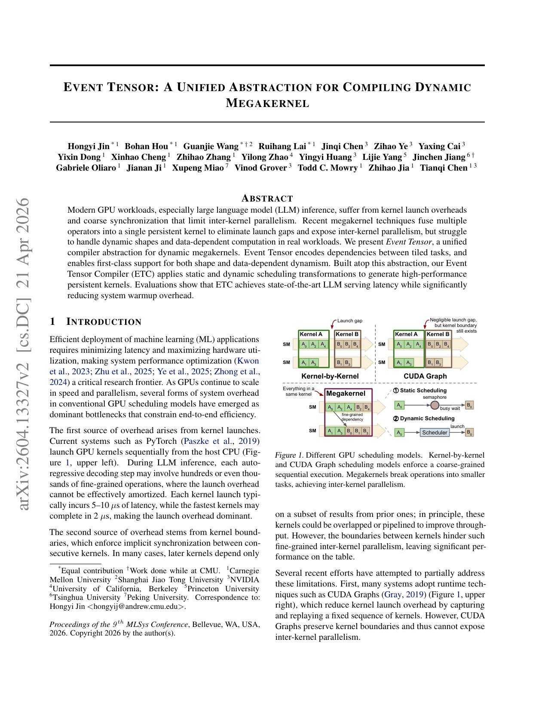

**图3** Event Tensor 将动态形状与数据依赖编码为 Tile 依赖图，生成 Persistent Kernel，在低 batch agentic 场景下实现 1.20–1.48× 加速。来源：arXiv:2604.13327 [4]。

### 2.5 直接证据的边界与研究空白

诚实地讲，本章的部分判断仍带有推断性质。现有文献**已经直接证实**的是：

1. kernel launch 本身在小模型/低 batch 场景可占单 token 时间的 **95%** [3][4]；
2. host 侧 HTTP + 调度在传统 serving 中占端到端时间的 **62%** [2]；
3. agentic 多轮交互产生的 scheduling bubbles 可占程序总延迟的 **58.2%** [50]。

**尚未被直接证实**的是：

- 在真实 agentic serving 系统中，"request state transition"（prefill↔decode 切换、工具调用暂停/恢复、subagent 分叉）相对于"kernel launch"和"工具执行"的独立 CPU 时间占比；
- 相同模型在"纯 chat 模式"和"agentic 模式"下，host 侧 control-path 结构的差异；
- Dynamo/SGLang/vLLM 等系统的 router、scheduler、block manager 等组件各自的 host CPU 占用。

这些空白并非因为研究者疏忽，而是因为：第一，"状态切换"横跨调度器、KV 管理器、请求路由等多个组件，现有 profiler 缺乏语义级自动分解能力；第二，agentic serving 作为明确研究领域仅 2025 下半年才集中出现，学术界尚未建立标准的 benchmark 来量化 orchestration overhead。填补这一空白需要推理引擎社区在关键控制路径上植入高精度 instrumentation，并设计能够对比 chat vs agentic 控制路径密度的标准化实验。

---

> **本章小结**：算子下发瓶颈已从微观 runtime 问题上升为系统架构问题。直接证据表明 kernel launch 和 host 调度已占主导 [2][3][4]，Continuum 直接量化了 agentic scheduling bubbles 占 **58.2%** [50]。推断性证据（Claude Code 代码结构 [41]、Dynamo router 工程 [9]、RAJ 工具延迟 [1]）共同指向 control-path density 上升的趋势。下一步需要推理引擎社区提供关键路径的精细化 profiling，才能将这一判断从"合理推断"推进到"精确测量"。
## 3. 主线二：KV 卸载——从"容量兜底"到"生命周期管理"

### 3.1 Agentic AI 把 KV 访问模式推向 write-once-read-many

在传统聊天式推理中，KV cache 往往随单轮请求生命周期结束而失去价值；在 agentic AI 中，会话状态、工具定义和中间推理上下文可能在长时间内持续复用。NVIDIA Dynamo 数据显示 [9]：

| 指标 | 数值 |
|---|---|
| 同一 worker 后续调用 cache hit | **85%–97%** |
| 4 个 teammate agent 聚合 cache hit | **97.2%** |
| 累计 read/write ratio | **11.7x** |

DualPath 论文（arXiv:2602.21548）基于生产环境 agent trace 进一步量化了这一特征：平均交互 **157 轮**，上下文 **32.7K tokens**，每轮仅追加 **429 tokens**，由此推算出 KV-Cache 命中率高达 **98.7%**。这些数据表明，在 agentic AI 中，系统压力正从"频繁写入新 KV"转向"如何保留、共享、路由和预取旧 KV"。

### 3.2 Engram 与 DeepSeek V4：两条互补的 KV 减负路线

在 KV 管理层，DeepSeek 同时推进了两条独立但互补的研究线：**Engram 条件记忆**（知识剥离路线）和 **V4 CSA/HCA 混合注意力**（序列压缩路线）。需要首先澄清的是：DeepSeek V4 技术报告（55 页）**全文未出现 "Engram" 一词**——两者是并行发展的研究线，而非集成关系。

#### 3.2.1 Engram：将静态知识从动态计算中剥离

Engram（arXiv:2601.07372，DeepSeek-AI + 北京大学）是一个通过 N-gram hash 实现 O(1) 静态知识检索的条件记忆模块 [30]。其核心机制包括 tokenizer 压缩、多路 hash、门控融合和多分支集成。与 KV Cache 存在本质区别：

| 维度 | KV Cache | Engram |
|---|---|---|
| **性质** | 运行时动态中间激活 | 训练好的静态嵌入参数表 |
| **依赖** | 前向隐藏状态动态生成 | 仅输入 token 序列，确定性哈希寻址 |
| **规模规律** | 随序列长度线性增长 | 参数量固定，与序列长度无关 |
| **系统行为** | GPU HBM 动态分配 | 可确定性预取，支持多级缓存与卸载 |

Engram 对推理系统的最大价值在于其**完全确定性的内存访问模式**：检索索引仅由输入 token 序列决定，一旦 token 序列已知，哈希地址即可预先算出。这使得系统可在执行前面 Transformer block 的同时，通过 PCIe **异步预取**下一 Engram 层所需的嵌入。

**关键性能数据**：在 NVIDIA H800 上，将 **100B 参数**的 Engram 表完全卸载到 Host DRAM，4B Dense 主干吞吐损失仅 **1.9%**，8B Dense 主干仅 **2.8%**（保守基线，强制所有检索走 PCIe，未利用 HBM 热缓存）。

CXL-Engram 论文（arXiv:2603.10087）进一步证明，Engram 的稀疏（每 token 每 layer 仅 5KB）、最小访问（所需带宽仅 ~**0.7 GB/s**）、延迟容忍三大特征使其成为 CXL 内存池的理想负载：在 SGLang 框架中，CXL 池化与本地 DRAM 的端到端吞吐差距 **<1.5%**；400B Engram + 16 节点可节省 **$166,040** [31]。

#### 3.2.2 DeepSeek V4：沿序列维度压缩 KV Cache

V4（2026-04-24 发布）放弃了从 V2 到 V3 使用的 MLA（Multi-Head Latent Attention），重回 **MQA**（Multi-Query Attention），并引入沿**序列维度**压缩 KV Cache 的 CSA/HCA 混合架构 [30]。

- **CSA（Compressed Sparse Attention）**：每 **4 个 token** 压缩为 1 个 entry，通过 Lightning Indexer 为每个 query 选择 top-k（Flash: 512, Pro: 1024）个压缩 entry，配合 **128-token 滑动窗口**保留局部依赖。
- **HCA（Heavily Compressed Attention）**：每 **128 个 token** 压缩为 1 个 entry，压缩后做 dense attention 提供全局视野。

**压缩效果**：在 **1M token 上下文**下，V4-Pro 的 KV Cache 仅为 V3.2 的 **10%**（约 9.62 GiB），V4-Flash 为 **7%**（约 6.72 GiB）；相比标准 Transformer BF16 GQA8 降至约 **2%**。

**但存在被忽视的瓶颈：Indexer 步骤才是真正的内存墙。** CSA 的 Lightning Indexer 通过可学习的评分投影为每个 query 选择 top-k 个压缩 key。其评分函数为：

$$I(t,s) = \sum_{h=1}^{H_I} w_{t,h} \cdot \text{ReLU}(q_{t,h} \cdot K_s^C)$$

其中 $q$ 为 query 投影，$K^C$ 为压缩后的 key，$w$ 为可学习权重，$H_I=64$ 为 indexer head 数。

问题在于：V4 参考实现（`model.py` 第 415–423 行）和 TileLang 参考实现都将该评分计算为一个融合的 einsum，**先物化形状为 `[B, S, H_I, T]` 的 FP32 中间张量**，再沿 $H_I$ 维度做 head sum 和 top-k 选择（$T = S/m$，$m=4$ 为 V4-Flash 压缩比）。这一物化步骤的内存开销如下 [46]：

| 序列长度 $S$ | 中间张量大小 | 与 H200 HBM (140 GB) 对比 |
|---|---|---|
| 32,768 | 64 GB | 可运行，但已占 46% HBM |
| 65,536 | **256 GB** | **OOM**——超过单卡 HBM 上限 |
| 131,072 | 1 TB | 远超单卡容量 |
| 262,144 | 4 TB | 需要多卡或 offload |

StreamIndex 论文明确指出："The indexer step is what gates CSA at long context, not the attention kernel." 现有长上下文优化（FlashAttention、Paged Attention、Ring Attention）都针对 attention kernel 或 KV cache，但 CSA pipeline 在 attention 运行之前就在 indexer 步骤 OOM 了——"the pipeline runs out of memory in the indexer step before attention runs" [46]。

更关键的是，这一瓶颈对机头 CPU 有直接的调度影响：
- 当 $S \geq 64K$ 时，Indexer 无法完全在 GPU HBM 内执行，必须借助 CPU DRAM 做 offload 或分块调度；
- StreamIndex 提出的 chunked partition-merge top-k 方案虽然将峰值 HBM 降至 **6.21 GB**（$S=1M$），但引入了 CPU 侧的 chunk 编排逻辑——需要在 host 侧维护分块状态、合并 per-tile top-k 结果；
- 在 $S=262K$ 时，StreamIndex 的 chunked indexer 配合 TileLang attention 仍需要 **18.56 GB** 峰值 HBM 和 **1.97 秒**完成——对实时服务仍是不可忽视的延迟。

这意味着，CSA 的"压缩"收益（4× 序列压缩）在 indexer 步骤被内存墙部分抵消。DeepSeek V4 能够在 1M 上下文上工作，必然在其内部实现中采用了某种形式的分块或流式索引器——但这一细节并未在技术报告中公开。StreamIndex 作为首个开源的 CSA 非物化实现，揭示了这一隐藏的工程复杂性。

#### 3.2.3 两条路线的互补性

| 路线 | 核心策略 | 对 KV Cache 的影响 | 对 AI 机头的影响 |
|------|---------|------------------|----------------|
| **V4 (CSA+HCA)** | 沿序列维度压缩 KV Cache | KV Cache 降至标准 Transformer 的 ~2% | Indexer 计算需要 CPU/GPU 协同；On-Disk KV Storage 需要 CPU 管理 |
| **Engram** | 将静态知识从注意力中剥离 | 释放 attention 容量；每 token 仅 5KB 检索 | 100B+ 参数表可完全卸载到 Host DRAM/CXL 池；确定性预取重叠计算 |

**互补性**：CSA/HCA 解决"序列太长，KV 存不下"的问题；Engram 解决"知识太多，重复计算"的问题。两者可以同时应用于同一模型：V4 的 CSA/HCA 负责压缩对话历史，Engram 负责检索事实知识——这是未来模型的合理演进方向。

### 3.3 分层 KV 存储：CPU 内存升级为 warm tier

NVIDIA 2025-09-18 的 Dynamo KV 文章将 KV offload 明确扩展到 CPU RAM、local SSD 和 remote/network storage [8]。这一定位转变说明，工业界已不再把 KV offload 看成"GPU 内存不够时的临时 spill"，而是把它当成**层次化容量与共享架构**。

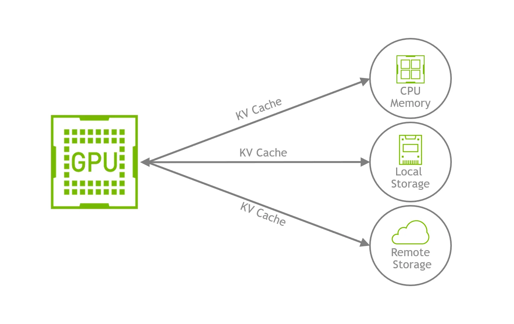

**图4** NVIDIA 给出的 KV offloading 架构图，强调 GPU 可把 KV 转移到更大、更便宜的存储层。来源：NVIDIA, 2025-09-18 [8]。

Grace Hopper / Grace Blackwell 通过 **NVLink-C2C 900 GB/s** 的 coherent interconnect 共享统一内存地址空间 [10]。这类设计的意义在于：
- CPU 内存可作为低摩擦的 KV staging / overflow / sharing 层
- GPU 不必每次显式复制与迁移数据
- 长会话、长上下文和 pause-resume 工作流的恢复路径更短

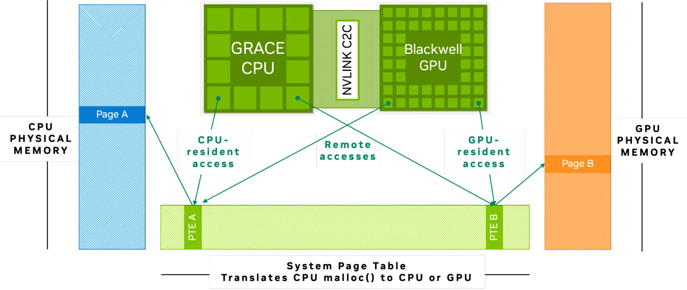

**图5** CPU 与 GPU 通过统一页表共享内存地址空间，使 host memory 更自然地成为 KV 的延伸容量层。来源：NVIDIA, 2025-09-05 [10]。

### 3.4 稀疏化 + 卸载：2025H2 以来的主攻方向

- **NOSA（2025-10，arXiv）**：首个"原生为 KV Cache Offloading 设计"的可训练稀疏注意力机制。它显式约束 CPU-GPU KV 传输量，在 1B/3B/8B 模型上相比全注意力实现最高 **5.04×** 解码吞吐提升，相比 InfLLMv2 和 ShadowKV 分别提升 **1.92×** 和 **1.83×** [6]。

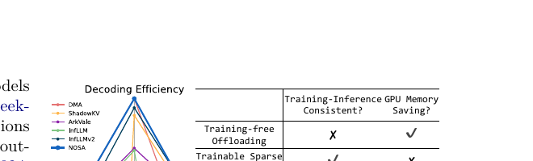

**图6** NOSA 架构：原生为 KV offloading 设计的稀疏注意力机制，显式约束跨设备传输量。来源：arXiv:2510.13602 [6]。

- **ScoutAttention（2026-03，arXiv）**：提出 Layer-Ahead CPU Pre-computation 算法，让 CPU 提前一层启动 Attention 计算，并通过异步周期性召回机制保持极低 CPU 负载。在保持精度损失 < **2.4%** 的前提下，相比现有卸载方法实现 **2.1×** 加速 [7]。

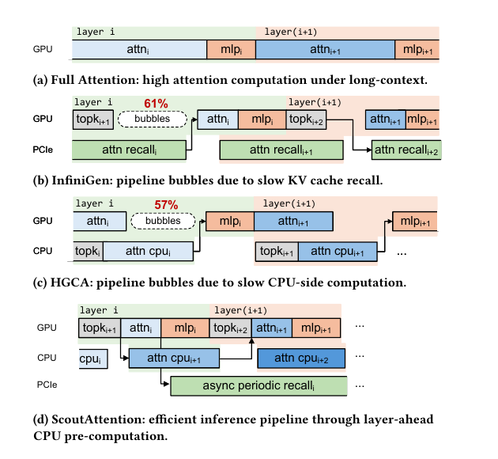

**图7** ScoutAttention 让 CPU 提前一层预计算 Attention，异步召回。来源：arXiv:2603.27138 [7]。

- **CoMEM（2025，OpenReview）**：针对 Agentic 长上下文，将历史压缩任务卸载到轻量级异步记忆模型，通过 k-step-off Pipeline 重叠记忆摘要与 Agent 执行，解码开销降低 **1.4×**。

### 3.5 模型驱动的 KV 管理：从启发式到"自引用式垃圾回收"

SideQuest（arXiv:2602.22603，NVIDIA）代表了 KV Cache 管理范式的重要演进：让模型自己判断哪些上下文已过时 [33]。

在多轮 Agentic 工作流中，token 的重要性是高度动态且非单调的——一个早期看似低重要性的 token，可能在十个回合后成为关键枢纽。传统启发式方法（如 H₂O、SnapKV）基于固定规则剪枝，容易不可逆地移除对下游推理至关重要的信息。

SideQuest 的核心设计是**并行辅助线程**：每隔固定间隔 fork 出一个辅助线程，在共享上下文上分析当前打开的工具输出，判断哪些已冗余，输出结构化删除命令（如 `{del_cursors: [0]}`）。这一设计在不污染主推理上下文的前提下，让 LRM 执行自我"垃圾回收"。

**关键数据**：在长程 Agentic 任务（FRAMES、BrowseComp）上，SideQuest 将峰值 token 使用减少 **56–65%**，KV Cache 内存读取减少 **53–71%**；在 H100 上峰值吞吐从 828 tok/s 提升至 **1,523 tok/s**（+83.9%），peak batch size 从 24 提升到 36。

### 3.6 CXL 内存扩展与 NVIDIA ICMSP：从技术问题到经济问题

Astera Labs 的 Leo CXL Smart Memory Controller（2025-11 实测数据）显示，在生产级 LLM 推理负载中 [15]：

| 指标 | 改善 |
|---|---|
| GPU 需求降低 | **87%** |
| Prefill 阶段 GPU 利用率提升 | **75%** |
| 每查询 CPU 利用率降低 | **40%** |
| 并发 LLM 实例支持 | **2×** |

**图8** CXL 内存扩展在生产级 LLM 推理负载中的建模数据。来源：Astera Labs, 2025-11 [15]。

与此同时，NVIDIA 在 CES 2026 推出的 Inference Context Memory Storage Platform（ICMSP）进一步将 KV cache offloading 推向硬件原生支持 [34]。ICMSP 利用 BlueField-4 STX 和 Spectrum-X 以太网交换机创建高速数据通路，绕过传统 CPU 瓶颈，声称相比传统存储路径可实现 **5x** token 吞吐、**4x** 能效提升和 **2x** 页面摄取速度。Jensen Huang 在 GTC 2026 上表示："这将是世界上最大的存储市场，本质上承载着全世界 AI 的工作记忆。"

Morgan Stanley 2026-03-18 的报告进一步确认了这一趋势：随着 AI 从"生成答案"转向"完成任务"，**DRAM 将取代 HBM 成为 AI 基础设施最紧缺的芯片瓶颈** [35]。服务器 DDR5 价格预计在 2026 Q2 环比上涨 **50%+**，企业级 NAND SSD 报价预计上涨 **40%–50%**。这意味着 KV warm tier 的设计已经进入"性能-容量-成本"三者联动的阶段，机头 CPU 的价值不只是容量兜底，而是整个推理经济模型的一部分。

### 3.7 预取与 Middle-Phase Thrashing：agentic AI 的关键补充机制

与传统 offload 不同，agentic AI 的工作流经常具备可预测性。Agent harness 往往知道工具调用何时可能返回，因此可以提前推测"下一次请求将需要哪些 KV 块"。这使得 `prefetch` 从存储系统中的常见优化，上升为推理生命周期管理的核心机制。

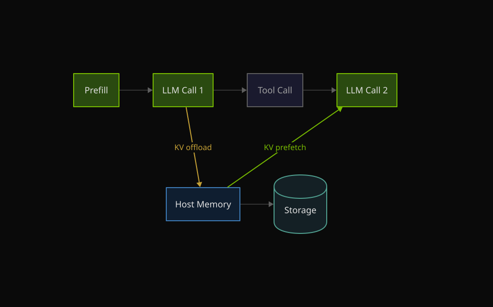

**图9** 工具调用后，KV 先被卸到主机/存储侧，再在第二次 LLM 调用前主动预取回 GPU。对 agentic AI 来说，预取和卸载是成对出现的。来源：NVIDIA, 2026-04-17 [9]。

然而，2026 年的一项关键研究揭示了 agentic batch inference 中的独特病理：**middle-phase thrashing** [33]。当多个 agent 异步推进时，一些 agent 正在积极生成 token，另一些则停滞等待外部工具，其 KV cache 暂时不活跃。在标准 LRU 淘汰策略下，这些不活跃但语义关键的前缀会在内存压力上升时被激进淘汰。当 agent 恢复时，系统必须通过重算或 host-device 传输重建整个前缀——而且这一开销在执行过程中反复支付。

这与传统 chat workload 的根本区别在于：chat 中的 prefix 要么活跃（正在被生成），要么可以安全淘汰（会话已结束）；而 agentic workload 中的 prefix 处于**"暂时不活跃但即将恢复"**的第三种状态，标准 LRU 对此状态毫无感知。

### 3.8 Agent Swarm 场景下的 KV 共享新机制

当 Agent 从"单线程"扩展到"多线程自组织"（Kimi Swarm 100 并行 sub-agents、Claude Code Agent Teams）时，KV Cache 管理面临全新的共享与复用问题。

#### 3.8.1 RelayCaching：打破 O(M²) 级联冗余

在多 Agent 流水线中，上游 Agent 的输出成为下游 Agent 的输入，标准系统必须从头重新计算 KV cache，导致累积预填充成本随交互轮次呈 **O(M²)** 增长。RelayCaching（arXiv:2603.13289）的核心突破是**直接将上游 decoding KV cache 重用于下游 prefill**，通过选择性修正（selective rectification）处理 prefix variation [36]：

- **重用率**：大多数多 Agent 设置中超过 **80%**
- **TTFT 加速**：2-Agent 时 2.10×，5-Agent 时 **4.71×**
- **长上下文加速**：vs Full Prefill **9.2×**
- **准确率保持**：GSM8K 84.84–85.50%（与 Full Prefill 相当）

**对机头的启示**：CPU 需要维护一个**跨 Agent 的 KV Cache 引用图**，追踪哪些 KV 块可被下游重用、哪些需要修正、以及修正的范围（layer range + token set）。

#### 3.8.2 PolyKV：从 O(N) 到 O(1) 的内存压缩

当 N 个 Agent 处理相同文档上下文时，PolyKV（arXiv:2604.24971）提出只计算一次 compressed KV state，每个 Agent 独立注入解压后的 KV tensor [37]：
- **内存复杂度**：O(N) → **O(1)**

**对机头的启示**：CPU 需要维护**共享 KV Pool**，管理压缩/解压的生命周期，并处理并发 Agent 对同一 KV 块的读写隔离。

#### 3.8.3 Hive Agent-Aware Scheduling：从请求平等到 Agent 优先级

Hive（arXiv:2604.17353）对 R3A 多 Agent 系统的剖析揭示：**>70%** 的总 token 消耗和调用频率集中在少数核心 Agent（Decision、Patcher、Viewer）。传统 LRU 驱逐可能因"最近访问"而误驱逐核心 Agent 的高复用 KV 状态 [38]。

Hive 的 Agent-Aware Scheduling 为每个 Agent 计算综合贡献分（Shapley 风格近似），KV Cache 驱逐时**优先保留高贡献 Agent 的状态**：
- **效果**：hotspot miss rate 降低 **33%–51%**，被驱逐 KV token 总量减少 **19.2%–30.2%**

**对机头的启示**：CPU 需要运行**轻量级的 Agent 贡献度分析**（滑动窗口统计），并将优先级指令实时下发到 GPU 侧的 KV Cache 管理器。

### 3.9 分层经济性：从"能不能卸"到"卸到哪一层最划算"

对 agentic AI 而言，更合理的结构通常不是单一 DRAM，而是：

| 层级 | 介质 | 适用场景 | 关键指标 |
|---|---|---|---|
| **最热** | GPU HBM | 当前活跃请求的 KV | 容量受限，带宽最高 |
| **温热** | Coherent CPU memory（NVLink-C2C） | 即将恢复、即将复用的 KV | 恢复延迟最低，带宽 900 GB/s |
| **温暖** | Host DRAM | 长会话保留、多 agent 共享前缀 | 容量大，带宽 ~614 GB/s |
| **扩展** | CXL Memory Pool / ICMSP | 多租户冷 KV、历史归档 | 容量极大，成本最低 |
| **冷** | Local SSD / Remote Storage | 极少访问的持久 KV | 容量无限，延迟 ms 级 |

机头 CPU 的选型因此出现分层：co-located GPU 节点强调一致性互连和主机内存带宽（Vera 的 NVLink-C2C 1.8 TB/s）；容量型节点强调 DRAM/CXL/ICMSP tier 的成本效率（EPYC Turin + CXL 扩展 + BlueField-4 STX）。这一分层决策不再只是技术问题，而是直接影响推理成本的架构经济问题。
## 4. 主线三：MoE 推理——从"稀疏计算优势"到"host-side orchestration 压力"

### 4.1 MoE 的效率收益并不自动转化为系统收益

MoE 通常被理解为"以更少的激活计算获得更大模型能力"，但这一说法忽略了系统代价。稀疏激活确实降低了每 Token 的 GPU 计算量，但代价是将系统复杂性转移到了 host 侧：专家总量往往远超单节点 GPU 的显存容量，权重搬运、路由预测、同步通信和拓扑放置都会显著增加 host-side 压力。

以 DeepSeek V4（1.6T 总参 / 49B 激活参，Pro 版本）为例 [30]，单节点 GPU 无法容纳全部专家权重。当专家权重被卸载到 CPU 内存时，每次 Token 路由命中冷专家都会触发同步 CPU→GPU 拷贝，成为解码阶段的决定性瓶颈。这一瓶颈的隐蔽性在于：它不会在 GPU 利用率指标上直接暴露，而是表现为 decode 阶段的间歇性停顿——GPU 在等待权重到达时处于空闲状态，但监控工具往往将其归类为"正常波动"。

DeepSeek V4 的 Flash 版本（284B 总参 / 13B 激活参）虽然参数更少，但其设计哲学与 Pro 版本一致：通过 MoE 架构将计算量控制在合理范围，同时将未激活专家的存储压力推给 host 侧内存。这种"GPU 算得少，CPU 搬得多"的权衡，正是机头 CPU 角色升级的核心驱动力。

Mixtral-8x7B 中每个 Token 可访问 47B 总参数，但仅 13B 参与计算，实现约 **3.6×** 的激活计算削减。这种"稀疏激活"特性使 MoE 在推理时具有天然效率优势，但也引入了独特的 host-side 复杂性。

### 4.2 为什么专家卸载会制造同步阻塞

MoE 推理中的专家权重卸载不是简单的"内存不够就搬"，而是触发了一系列同步依赖：

1. **路由决策必须在权重搬运之前完成**：CPU 侧的路由算法（如 Top-K gating）决定每个 token 去哪些 expert，这一决策本身就需要访问当前层的输出表示。
2. **冷专家命中触发同步 DMA**：如果目标 expert 不在 GPU 显存中，CPU 必须发起 PCIe/C2C 传输，而 GPU 上的计算流水线必须等待传输完成才能继续。
3. **All-to-All 通信需要 CPU 驱动的同步信号**：跨 GPU 的 token/expert 数据交换依赖 NCCL 集合通信，其同步点由 host 侧进程驱动。

这一同步链意味着：MoE 不是"GPU 算得更少，系统就更轻"，而是 **GPU 计算负载变稀疏之后，host-side 的路由、权重驻留和通信编排反而更容易露出水面**。

### 4.3 2026 年的主要突破：三条互补的解决路径

针对上述同步阻塞问题，2026 年的研究提出了三条互补的解决路径：

**路径一：基于内部表示的专家推测预取**

Speculating Experts（2026-03，arXiv）利用当前层已计算的内部表示（归一化残差流 + 默认向量）推测下一层将激活的专家，实现权重预取与 GPU 计算的重叠 [11]。其核心洞察是：expert 路由决策所需的信号在计算当前层时就已经部分可用，不需要等到当前层完全结束。在 Qwen-30B-A3B 等模型上，相比按需加载实现 **14%** 的 TPOT 降低。

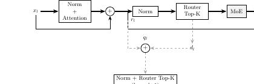

**图10** Speculating Experts 利用内部表示推测未来专家，重叠 CPU-GPU 传输与计算。来源：arXiv:2603.19289 [11]。

**路径二：逻辑身份与物理驻留的解耦**

FluxMoE（2026-04，arXiv）采取了另一条路径：不解耦路由预测，而是解耦"逻辑专家身份"与"物理驻留位置" [12]。它通过带宽均衡的存储层次（压缩 GPU 内存 + 主机 DRAM）动态流式化参数，使得无论路由预测准确率如何，系统都能以稳定的带宽利用率完成权重搬运。这摆脱了对路由预测准确率的依赖，从根本上消除了"预测失败 → 冷启动延迟"的尾部风险。

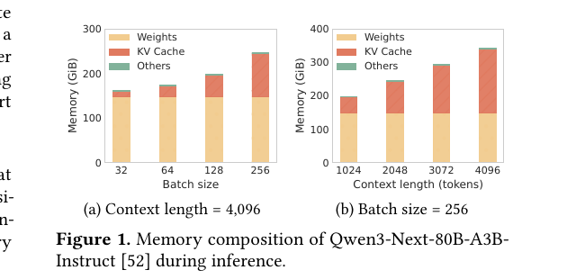

**图11** FluxMoE 解耦逻辑专家身份与物理驻留位置，动态流式化参数。来源：arXiv:2604.02715 [12]。

**路径三：细粒度 expert map 驱动的预取**

FineMoE（EuroSys 2026）提出了更精细化的方案 [31]。它引入 **expert map** 数据结构来追踪细粒度的专家激活模式，而非传统粗粒度的专家追踪方法。当请求到达时，FineMoE 通过语义相似性和轨迹相似性搜索历史 expert map，指导预取决策。实验显示，这种细粒度预取相比粗粒度方法显著降低了 expert miss 率。

**路径四：Speculative Decoding + Expert Offloading 融合**

SpecMoEOff（2025 后期）将 speculative decoding 与 expert offloading 结合，通过扩展专家工作负载来隐藏卸载延迟，实现最高 **2.5×** 的 decode 吞吐提升 [32]。这一方法的关键洞察是：speculative decoding 产生的额外 token 可以作为"填充负载"，在 GPU 计算这些 token 的同时，CPU 异步搬运下一层所需的专家权重。

### 4.4 CPU 在 MoE 中的三重负载

1. **权重搬运**：PCIe / C2C 带宽有限，CPU 负责将专家权重从主机内存拷贝到 GPU。以 DeepSeek V4-Pro 为例，单次冷专家命中可能涉及数 GB 权重的同步传输。
2. **路由协调**：All-to-All 集合通信的同步信号由 CPU 侧进程驱动；若任一 Rank 的 CPU 延迟，全网 GPU 等待。这种"单点阻塞放大为集群停滞"的效应与算子下发中的 CPU 竞争问题同构。
3. **负载均衡与调度**：动态专家剪枝、容量因子调整、冷热专家分级策略均需在 CPU 侧实时决策。NVIDIA Wide EP（2025-12）进一步将 MoE host 压力从"单请求驱动"推向"批级路由 + 跨节点通信拓扑编排" [28]。

MoE 推理的关键已扩展到 expert 路由、放置和跨 GPU 通信拓扑。对 agentic workload 而言，这一压力还会进一步与 KV 生命周期和多代理并发叠加。

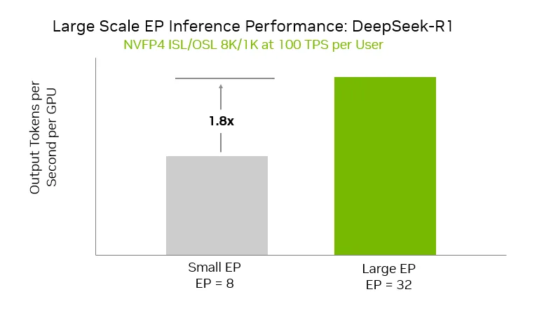

**图12** NVIDIA wide expert parallelism 示意图，强调 MoE 推理的关键已经扩展到 expert 路由、并行放置和通信拓扑。来源：NVIDIA, 2025-12-18 [28]。

## 5. 主线四：PD 分离——从"单节点调度器"到"跨池编排中枢"

### 5.1 为什么 PD 分离会把 CPU 推向跨池编排

Prefill 阶段计算密集（每 Token 需要一次完整的 Transformer 前向传播），Decode 阶段内存带宽密集（每 Token 仅追加一个位置，但需要读取全部历史 KV）。将这两个阶段部署到同一 GPU 上会产生资源竞争：prefill 抢占 compute，decode 抢占 memory bandwidth，两者互相干扰。

PD 分离通过物理隔离解决了这一干扰问题，但代价是将系统瓶颈从"单节点资源竞争"转移为"跨节点状态搬运"。机头 CPU 不再只管理单节点 GPU，而是需要承担三项新增职责：

1. **跨节点 KV Cache 的序列化、传输与反序列化**
2. **预填充池与解码池之间的动态负载均衡**
3. **网络拥塞下的尾延迟控制**

### 5.2 PD 分离已成为生产默认架构

2024 年的 DistServe 与 Splitwise 首次系统论证了 PD 分离的收益，而到 2025 年底，Hao AI Lab 的回顾性分析确认该架构已成为"几乎每个主要 LLM 服务栈的默认手册"。vLLM、SGLang、NVIDIA Dynamo、TensorRT-LLM 与 llm-d 均已原生支持 PD 分离。

2026-03-23 的 NVIDIA Kubernetes 文章把 `disaggregated LLM inference` 明确拆成 `ingress-router`、`prefill worker`、`decode worker`，并用 NIXL 负责节点间高吞吐数据传输 [22]。这一架构拆分说明 host 侧职责已从"单机发命令"扩展为 router + stage scheduling + transfer orchestration 的三位一体。

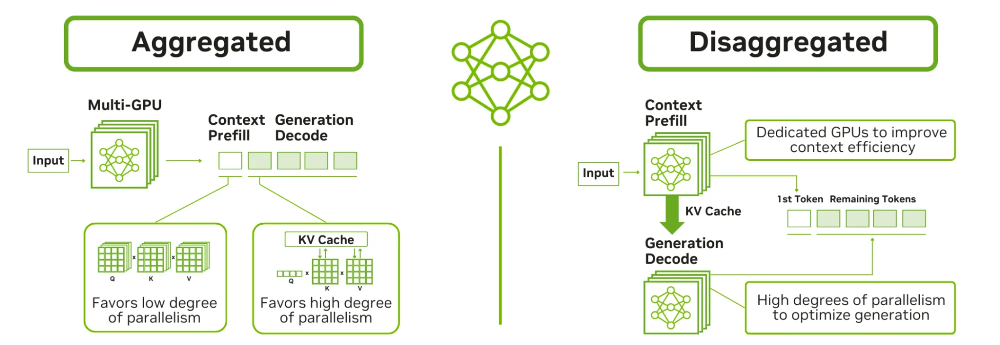

**图13** NVIDIA 在 Kubernetes 上展示的解耦式推理拓扑。host 侧职责从"单机发命令"扩展为 router + stage scheduling + transfer orchestration。来源：NVIDIA, 2026-03-23 [22]。

### 5.3 KV Cache 传输开销：同节点 vs 跨节点的数量级差异

PD 分离的收益高度依赖于传输拓扑：

- **同节点 NVLink**：DistServe 报告传输开销 < 总服务时间的 **0.1%**，可忽略。这是因为 NVLink 提供 900 GB/s 级别的带宽，1.13 GB 的 KV Cache 可在毫秒级完成传输。
- **跨节点网络**：Splitwise 计算表明，OPT-66B 在 512 Token 输入下产生约 **1.13 GB** KV Cache；若请求率达到 10 req/s，需约 **90 Gbps** 带宽才能避免瓶颈。在典型数据中心网络（25–100 Gbps）中，这一带宽需求并不富裕。

这意味着 PD 分离的部署拓扑直接决定了 CPU 的网络编排压力。同节点场景下 CPU 只需管理完成队列；跨节点场景下 CPU 需要管理 RDMA 连接、拥塞控制、重传策略和尾延迟隔离。

### 5.4 CPU 管理 host-resident 传输栈的价值验证

llm-d 0.5（2026-02）的 UCCL Backend 采用 host-resident software transport stack，由 CPU 管理传输逻辑而非完全依赖硬件卸载 [22]。实验结果显示：在网络拥塞下，UCCL 的尾延迟恶化仅 **7.1%**，而传统 UCX 的恶化达 **17.1%**。这一对比验证了机头 CPU 在拥塞控制中的关键作用——不是因为它比硬件快，而是因为它能根据应用层语义（KV Cache 的优先级、恢复时间约束）做出更智能的调度决策。

### 5.5 Agentic 长交互进一步放大 CPU 调度压力

Agentic 工作负载通常表现为**短输入 + 极长输出**（多轮工具调用后的推理链），这意味着 decode 阶段持续时间远超 prefill。PD 分离后：

- **Decode 池**需要长时间维持大量并发流的 KV Cache 状态，每个流的 KV 都可能需要在暂停期间卸载并在恢复时预热。
- **Prefill 池**则需快速处理频繁到达的新工具调用结果，这些结果往往以短 burst 形式到达，要求 prefill worker 具备快速上下文切换能力。

机头 CPU 的调度器必须在两个池之间做动态负载均衡，并处理 KV Cache 的跨池预热、迁移与回收。vLLM 2026 Q1 Roadmap 明确将"CPU KV cache production ready"和"disaggregated prefilling & KV transfer support"列为核心目标，侧面反映了 CPU 侧调度复杂度正在快速上升。

### 5.6 Middle-Phase Thrashing：Agentic Batch Inference 的独特病理

2026 年的一项关键研究（arXiv:2601.22705）揭示了 agentic batch inference 中的独特病理：**middle-phase thrashing** [33]。当多个 agent 异步推进时：

- 一些 agent 正在积极生成 token（活跃状态）
- 另一些 agent 停滞等待外部工具返回（不活跃但语义关键状态）
- 在标准 LRU 淘汰策略下，这些不活跃的前缀会在内存压力上升时被激进淘汰
- 当 agent 恢复时，系统必须重建整个前缀——通过重算或 host-device 传输
- 关键是：这一开销在执行过程中**反复支付**，即使总 agent 数量保持不变

这与传统 chat workload 的根本区别在于：chat 中的 prefix 要么活跃（正在被生成），要么可以安全淘汰（会话已结束）；而 agentic workload 中的 prefix 处于**"暂时不活跃但即将恢复"**的第三种状态，标准 LRU 对此状态毫无感知。

这一发现对机头 CPU 的直接影响是：简单的 LRU eviction policy 在 agentic 场景下会失效，需要 workload-aware 的 retention hint 或 agent-state-aware 的优先级队列。NVIDIA Dynamo 的 `retention`、`routing`、`prefetch` 框架 [9] 和 LMCache 的 persistent disk backend [36] 都是对这一问题的回应。

## 6. 真实工作负载：对四条主线的修正与补充

底层 serving 论文容易假设"单上下文、长 decode、纯文本输入"，但真实 agentic 产品形态修正了这些假设。更重要的是，这些产品形态并非独立存在，而是与第四章的四条技术主线形成了交叉验证——它们说明主线分析的方向正确，但力度和侧重点需要调整。

### 6.1 三条被修正的假设

| 传统假设 | 真实产品形态的修正 | 关联主线 |
|---|---|---|
| 单上下文、长 decode | **多上下文并存、高频短回合** | 算子下发 + KV 生命周期 |
| 纯文本输入 | **多模态截图/视觉输入** | 算子下发（prefill 压力） |
| 稳定平均并发 | **极宽瞬时 fan-out/fan-in** | PD 分离 + MoE 路由 |

### 6.2 OpenClaw / 豆包 Mobile Use Agent：多模态 prefill 与高频状态切换

OpenClaw 官方仓库已把产品形态定义为 `always-on` 的 personal AI assistant，覆盖 Android node、screen recording、camera、Canvas 等持续在线入口。火山引擎 2026-04-29 发布的 Mobile Use Agent 则进一步明确为基于云手机与豆包视觉模型的 enterprise Android agent。

这类产品对机头 CPU 的真正含义不是"工具多"，而是**推理模式本身的改变**：

- **多模态 prefill 压力**：GUI agent 需要把截图送入模型，prefill 计算量往往比纯文本重一个数量级。
- **高频短回合调度**：交互表现为短回合、频繁状态刷新，decode 未必长，但请求切换频繁，CPU 调度器面临更高的状态切换频率。
- **更细粒度的 KV 生命周期管理**：单步推理较短，但状态连续性要求更高，host 更可能频繁做 session pinning、warm KV 保留和 resume。

**与主线的交叉点**：这直接放大了主线一（算子下发）和主线二（KV 生命周期）的压力。高频 prefill 意味着更高的 Kernel Launch 频率；高频状态切换意味着更频繁的 KV offload/reload 决策。DeepSeek V4 的 CSA/HCA 压缩对此类 workload 尤为适配——压缩后的 KV 体积更小，状态切换时的搬运成本更低。

### 6.3 Claude Code subagents：session multiplicity 与运营基础设施的主导地位

Anthropic 官方文档明确说明，Claude Code `subagents` 各自拥有 `separate context window`，会因单独收集所需上下文而带来额外延迟。Dive into Claude Code 论文（arXiv:2604.14228）基于源代码的系统性分析揭示了几个被忽视的关键数字 [41]：

- **代码占比惊人**：AI 决策逻辑仅占约 **1.6%**，运营基础设施占 **98.4%**。这 98.4% 包括权限门控（7 层独立安全机制）、工具路由、五层 context compaction pipeline、对话恢复逻辑、sub-agent 生命周期管理等。
- **Token 消耗**：Agent Teams 模式消耗约 **7×** 标准会话的 token。
- **上下文压缩五层设计**：Budget reduction → Snip → Microcompact → Context collapse → Auto-compact，遵循"惰性降级"原则，仅在廉价策略不足时才升级到更激进的压缩。
- **三种隔离模式**：Worktree（临时 git worktree）、Remote（远程环境）、In-process（默认，隔离对话上下文）。

这件事对推理侧 CPU 的含义是：

- **会话数暴增**：一个主代理外加多个 subagents，等价于更多并行或准并行上下文。
- **prefill 占比上升**：subagent 带着干净上下文启动，天然更容易形成"短 burst + 重 prefill"。
- **KV 复用更偏局部**：主代理和子代理不会天然共享同一整块上下文，host 需要更细地做 session-level placement 和复用决策。
- **CPU 侧运营基础设施决定系统上限**：98.4% 的代码在 CPU 侧执行，意味着优化 AI 机头的投资回报率远高于单纯升级 GPU。

**与主线的交叉点**：这抬高了主线二（KV 管理）中 session multiplicity 的权重。系统优化的目标不应再是"单条上下文能撑多长"，而是"同时管理多少条独立上下文而不崩溃"。这也解释了为什么 NVIDIA Dynamo 强调 4 个 teammate agent 聚合后 cache hit 可达 **97.2%** [9]——subagent 之间天然共享 system prompt 和 tool definitions，前缀复用率极高。

### 6.4 Kimi Agent Swarm：burst handling 与水平扩展

Kimi 官方 2026-04-11 的 Agent Swarm 文章给出的产品形态非常直接：`up to 100 sub-agents working in parallel`，单次任务可执行 **>1,500 次工具调用**，相比串行执行结果交付速度快 **4.5×** [39]。K2.6 进一步扩展至 **300 并行 sub-agents**、**4,000 协调步骤**。

这种 workload 给机头 CPU 带来一个此前不够突出的要求：

- **瞬时 fan-out 调度能力**：大量子代理会在短时间内同时进入 prefill 或 decode。
- **返回汇总时的 fan-in 压力**：上层代理需要消化来自多子代理的中间输出，再触发下一轮推理。
- **批处理与公平性冲突**：为了提吞吐，系统会想做 batch；但 swarm workload 又容易因为宽并发而拖高尾延迟。
- **上下文天花板突破**：单 Agent 的长程任务会被上下文窗口填满，被迫进行有损压缩（history folding / summarization）。Swarm 通过任务分解将长上下文需求分散到多个 sub-agents，每个只负责特定子任务。

**与主线的交叉点**：这同时挑战了主线一（调度器能否承受 burst launch）、主线四（PD 分离后 decode 池能否承受 100 条并发流的 KV 状态）和主线三（MoE 路由能否在 burst 下维持低抖动）。DeepSeek V4 的 1M token 默认上下文对此类 workload 是双刃剑：更大的上下文意味着更高的 KV 容量需求，但也意味着更少的 truncation 和更连贯的多轮推理。

### 6.5 系统级研究：Agent Swarm 对机头 CPU 的量化影响

2025-2026 年学术界涌现了一批专门针对多 Agent 推理系统的研究，从系统层面量化了 Agent Swarm 对机头 CPU 的压力。

#### 6.5.1 Hive：Agent 异质性与贡献感知调度

Hive（arXiv:2604.17353）对开源多 Agent RTL 修复系统 R3A 的剖析显示 [38]：
- **>70%** 的总 token 消耗和调用频率集中在少数核心 Agent（Decision、Patcher、Viewer）
- 各 Agent 在输入/输出长度、KV Cache 占用、上下文复用模式上表现出**显著的异质性**

Hive 提出 **Agent-Aware Scheduling**：基于 Shapley 风格贡献分为每个 Agent 计算优先级，KV Cache 驱逐时优先保留高贡献 Agent 的状态。在内存受限环境（`mem-fraction-static = 0.23`）中：
- Hotspot hit rate 从 0.935 提升到 **0.967**
- 被驱逐 KV token 总量减少 **19.2%–30.2%**

Hive 还提出 **Logits Cache**：将 decoding 过程中的中间 logits 序列缓存到 CPU 主存，通过重放采样消除 Tree-of-Thoughts 等 TTS 算法中的跨路径冗余，Hotspot Sampling 平均加速 **1.76×**。

**对机头的启示**：CPU 需要运行轻量级的 Agent 贡献度分析，并将优先级指令实时下发到 GPU 侧的 KV Cache 管理器。CPU 主存成为算法级缓存层。

#### 6.5.2 RelayCaching：打破 O(M²) 级联冗余

RelayCaching（arXiv:2603.13289）量化了多 Agent 流水线中的级联冗余 prefill 问题 [36]：在 M 轮交互的流水线中，累积预填充成本呈 **O(M²)** 增长。其核心突破是将上游 decoding KV cache 直接重用于下游 prefill：
- **KV Cache 重用率**：**>80%**
- **TTFT 加速**：2-Agent 时 2.10×，5-Agent 时 **4.71×**
- **长上下文（512–12,288 tokens）**：vs Full Prefill 加速 **9.2×**

**对机头的启示**：CPU 需要维护一个跨 Agent 的 KV Cache 引用图，追踪哪些 KV 块可被下游重用、哪些需要选择性修正。

#### 6.5.3 AMPD：PD 分离的自适应调度

AMPD（arXiv:2602.14516）针对多轮/Agentic 工作负载中 PD 分离的增量 prefill 调度问题 [40]：
- 标准 PD 分离针对单轮设计，忽略了多轮推理中交错的 prefill-decode 模式
- 提出基于实时负载的 SLO 导向自适应路由：**13.9%–31.7%** 的 prefill 任务应路由到 decode worker 本地执行
- 叠加 TTFT-aware prefill reordering（lookahead window w=3）

**效果**：
- vs Dynamo（PD 分离基线）：SLO attainment 提升 **67.29%**（平均）/ **967.54%**（最高）
- vs vLLM（同构基线）：提升 **339.74%**（平均）/ **3435.1%**（最高）

**对机头的启示**：CPU 侧调度器必须同时感知 GPU 负载和网络负载，实时决策 prefill 路由。

#### 6.5.4 KAIROS：Agentic 推理的功耗危机

KAIROS（arXiv:2604.16682）发现 Agentic inference 的功耗比传统单轮 LLM serving 高 **2–3 个数量级** [42]。根本原因在于：单次推理被替换为多次工具交错的、有状态的 LLM 调用；同时 serving 系统需在 prefix/context cache 中保留历史 token。

关键发现：
- 平均并发 **17 个 Agent**，平均 **37 轮**交互，最长 **2,518 轮**
- GPU 频率从 1680 MHz 降到 **900 MHz** 可降功耗约 **30%**
- **低于 900 MHz** 后系统进入 thrashing 状态：上下文累积超过 GPU 内存，反而增加能耗
- KAIROS 实现平均 **27%** 功耗降低（最高 **39.8%**），多实例降低 **46.3%**

**对机头的启示**：CPU 侧的并发控制和频率调节成为能效管理的关键。CPU 需要防止聚合上下文超出 GPU 内存，避免 thrashing。

#### 6.5.5 PolyKV：共享压缩 KV Pool

PolyKV（arXiv:2604.24971）提出当 N 个 Agent 处理相同文档上下文时，只计算一次 compressed KV state，内存复杂度从 **O(N)** 降到 **O(1)** [37]。每个 Agent 独立注入解压后的 KV tensor。

**对机头的启示**：CPU 需要管理共享 KV Pool 的压缩/解压生命周期，并处理并发 Agent 的读写隔离。

### 6.6 综合推断

如果把 OpenClaw、Claude Code、豆包 Mobile Use Agent、Kimi Swarm 放在一起看，agentic LLM inference 对机头 CPU 的新增要求可以归纳为五条：

1. **高频 prefill 调度**：不再是"长 decode 流水线"假设下的轻量调度。
2. **多上下文并存管理**：session multiplicity 的优化目标从"单条长度"转向"并发条目数"。
3. **极宽 fan-out/fan-in**：burst handling 成为与平均吞吐同等重要的指标。
4. **多模态 ingress 编排**：视觉输入重入推理链路后，host 侧排队、状态切换与内存压力同步上升。
5. **跨 Agent KV 共享协调**：从单条 KV 生命周期管理扩展到跨 Agent 的引用、重用、合并和驱逐决策。

这五项需求并非独立于四条主线之外，而是对主线分析的具体化和修正：它们说明，如果只从底层 serving 论文出发，会低估 agentic workload 对 host CPU 的真实压力。DeepSeek V4 的架构选择（CSA+HCA 压缩、1M 默认上下文）可以看作是对这些真实需求的工程回应；而 Engram 的确定性预取机制则为未来同时管理 100+ 条独立上下文的系统提供了关键基础设施。
## 7. 平台信号：硬件路线图正在围绕 CPU 控制平面收敛

### 7.1 NVIDIA Vera CPU — 专为 Agentic 推理设计的机头处理器

2026 年 3 月 GTC 上，NVIDIA 将 Vera CPU 从"GPU 附属品"重新定位为可独立部署的 Agentic 编排核心。这是本次洞察最具标志性的产品信号 [13][14][17]：

- **核心规格：** 88 颗定制 Olympus Armv9.2 核心，支持 NVIDIA Spatial Multithreading（SMT），单芯片 2270 亿晶体管；LPDDR5X 内存带宽达 **1.2 TB/s**；NVLink-C2C 与 GPU 互联带宽 **1.8 TB/s**。
- **Agentic 定位：** NVIDIA 官方将 Vera 定义为"AI Factories 的控制平面"，强调其在沙箱执行、RL 后训练反馈循环中的低尾延迟表现，相比竞品沙箱性能提升 **50%**。
- **独立商业模式：** Meta 已签署大规模 Grace-only 部署协议并计划 2027 年引入 Vera；CoreWeave、Oracle、Alibaba、ByteDance 等云厂商将在 2026 下半年提供 standalone Vera CPU 实例。

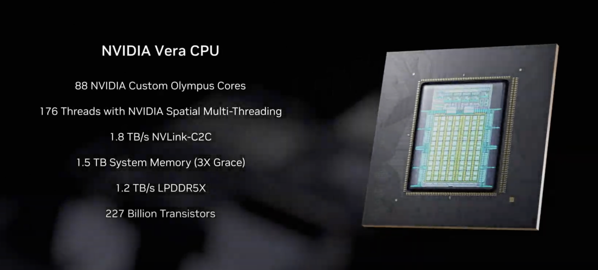

**图14** NVIDIA Vera CPU 架构与关键指标。88 颗 Olympus 核心与 1.2 TB/s LPDDR5X 内存带宽使其成为当前面向 Agentic AI 编排密度最高的机头 CPU 之一。来源：NVIDIA GTC 2026 [13]。

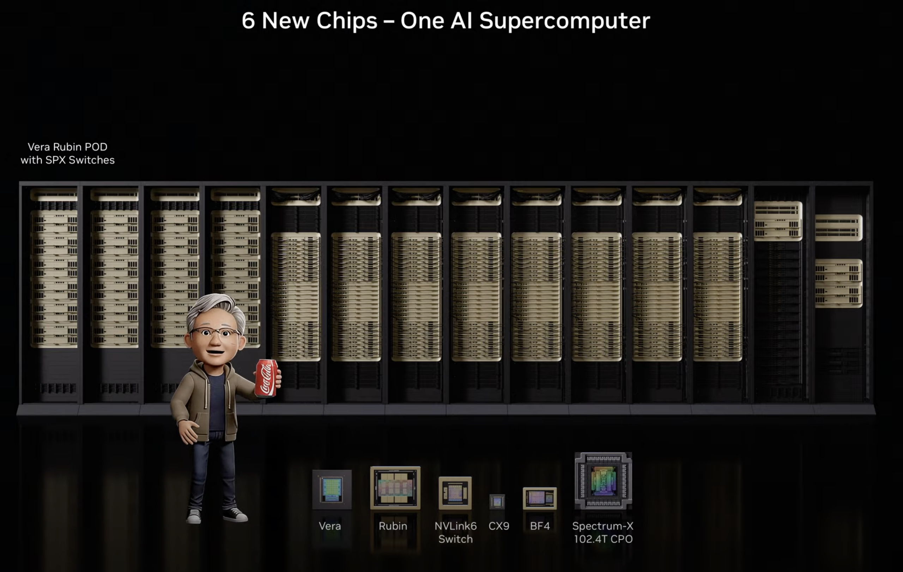

**图15** Vera Rubin 平台采用"极端协同设计"，将 Vera CPU、Rubin GPU、NVLink 6 Switch、ConnectX-9、BlueField-4 DPU 与 Spectrum-6 以太网交换机构建为统一系统。来源：StorageReview, 2026 [14]。

### 7.2 BlueField-4 STX / ICMSP — 从 DPU 到 AI-Native Storage

BlueField-4 的演进代表了平台信号中最容易被忽视的一环。早期的 BlueField-1/2 专注于网络、存储和安全加速；BlueField-3 扩展了大规模 AI 网络的在线加速和隔离；而 **BlueField-4 STX** 则被重新定位为 AI-Native Storage 的核心组件 [34][37]。

NVIDIA 在 CES 2026 推出的 Inference Context Memory Storage Platform（ICMSP）利用 BlueField-4 STX 和 Spectrum-X 以太网交换机创建高速数据通路，绕过传统 CPU 瓶颈 [34]。ICMSP 的关键指标包括：

- **5x** token 吞吐提升（相比传统存储路径）
- **4x** 能效提升
- **2x** 页面摄取速度

Jensen Huang 在 GTC 2026 上将其定义为"世界上最大的存储市场"——本质上承载着全世界 AI 的工作记忆。这一信号的重要性在于：它说明 NVIDIA 已经将 KV cache 管理从"CPU 的副业"提升为"独立硬件层的核心业务"。BlueField-4 STX 管理 KV placement 的硬件实现，消除了元数据开销，减少了 GPU 与存储之间的数据移动。

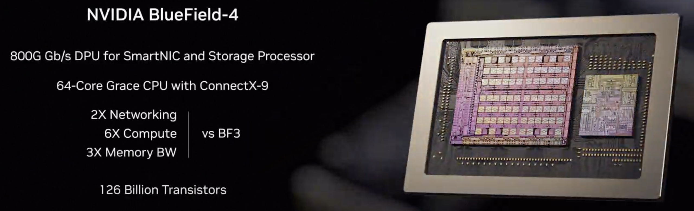

**图16** BlueField-4 集成 64 核心 CPU 与 ConnectX-9 SuperNIC，将网络、存储和安全处理从 Vera CPU 与 Rubin GPU 上卸载。来源：StorageReview, 2026 [14]。

### 7.3 CPU:GPU 配比结构性翻转

产业共识（NVIDIA GTC 2026、TrendForce、Arm、AMD）认为，传统 AI 数据中心 1:4–1:8 的 CPU:GPU 比例将向 **1:1–1:2** 演进；每 GW 所需 CPU 核心从 3000 万增至 **1.2 亿**（**4×**） [16][18][19][20]。

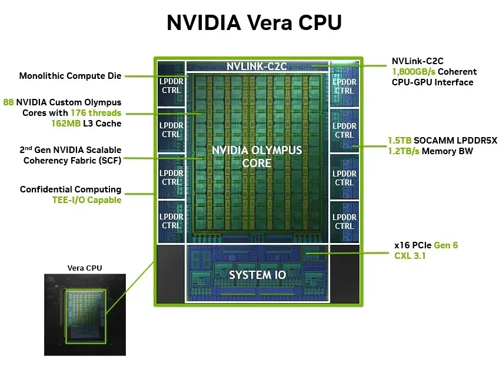

**图17** TrendForce 分析显示 Agentic AI 正在重塑 CPU:GPU 比例。来源：TrendForce, 2026-04 [16]。

AMD 在 2026 年的官方技术博客中进一步明确：Agentic AI 时代工作负载结构变化使 CPU 侧负载显著上升——CPU 负责编排、Agent 执行、工具调用、策略和安全 [43]。CPU:GPU 配比从聊天机器人的 1:4-8 转向 Agentic AI 的 **1:1**，某些场景 CPU 侧负载甚至更高。

Morgan Stanley 2026-03-18 的报告提供了更激进的经济学视角 [35]：随着 AI 从"生成答案"转向"完成任务"，**DRAM 将取代 HBM 成为 AI 基础设施最紧缺的芯片瓶颈**。其判断依据包括：

- 频繁的工具调用和多步编排显著增加了 CPU 计算和内存访问
- 频繁的上下文共享和 KV cache offloading 使 DRAM（而非 HBM）成为硬约束
- 服务器 DDR5 价格预计在 2026 Q2 环比上涨 **50%+**
- 企业级 NAND SSD 报价预计上涨 **40%–50%**
- SK Hynix 2026-2027 EPS 预测被上调 **24%** 和 **32%**

这一趋势与 DeepSeek V4 的 CSA/HCA 压缩和 Engram 条件记忆研究形成了相互印证：当静态知识被显式推向 CPU RAM 时，DRAM 容量和带宽的需求会出现结构性跳升。

### 7.4 机头 CPU 产品横向对比

截至 2026 年 Q2，三大厂商均发布了面向 Agentic AI 推理的机头 CPU 方案：

| 指标 | NVIDIA Vera | AMD EPYC Turin | Intel Xeon 6 Granite Rapids |
|---|---|---|---|
| **核心架构** | 88 核 Olympus (Armv9.2) | 最高 192 核 Zen 5 | 最高 128 核 P-core |
| **内存带宽** | **1.2 TB/s** LPDDR5X (~14 GB/s/核) | ~614 GB/s DDR5 (~3.2 GB/s/核) | ~307 GB/s DDR5 (~2.4 GB/s/核) |
| **GPU 互联** | NVLink-C2C **1.8 TB/s** | PCIe Gen5 x128 | PCIe Gen5 |
| **Agentic 实测** | 沙箱性能 **1.5×** 于 x86；Redpanda cross-core 吞吐 **+73%** | 32 核后带宽饱和扩展平坦 | 单核频率 5.0–5.7 GHz，延迟敏感型占优 |
| **独立部署** | 已确认 standalone 商业模式 | 传统服务器市场主导 | 受 18A 良率影响量产或延至 2027 |

**关键洞察：**
- **Vera** 的优势在于单芯片统一内存域 + 极高每核带宽，对 Kernel Launch 密集、KV Cache 调度的 Agentic 负载极为适配。
- **AMD Turin** 仍是核心密度与 TCO 冠军，每美元吞吐量最高，但 Chiplet 架构跨 CCD 通信存在 NUMA 延迟。
- **Intel Granite Rapids** 单核频率最高，在 tokenization、JSON 解析、API 序列化等串行任务上仍有优势。

### 7.5 机头 CPU 选型分层建议

| 节点类型 | 首选平台 | 关键理由 |
|---|---|---|
| **GPU 伴随型推理节点**（co-located） | NVIDIA Vera（或 Grace） | NVLink-C2C 1.8 TB/s + 统一内存地址空间，KV reload/prefetch 路径最短 |
| **通用推理网关 / 纯 CPU 编排节点** | AMD EPYC Turin | 192 核密度 + 成熟软件生态 + 最优 TCO |
| **极致延迟敏感型边缘节点** | Intel Xeon 6 Granite Rapids | 5.0–5.7 GHz 单核频率，tokenization/API 解析尾延迟最低 |
| **容量优先型 KV 存储节点** | EPYC Turin + CXL 扩展 | 大容量 DRAM + CXL Memory Pooling，分层经济性最佳 |
## 8. 讨论：现有研究的共识、关联与不足

### 8.1 当前较稳健的共识

基于现有材料，结合 DeepSeek V4 技术报告、Engram 条件记忆论文和 2026 年最新研究，至少可形成以下较稳健的共识：

1. **机头 CPU 已进入推理关键路径。** 无论从 PD 分离、KV 生命周期管理、MoE 编排还是真实 agent workload 看，CPU 已不是外围组件。vLLM 实测显示 GPU 实际计算仅占端到端时间的 **38%**，其余 **62%** 消耗在 host 侧服务、调度和数据传输上 [2]。
2. **CPU 瓶颈的本质不是"算得慢"，而是"编排链路太长"。** 真正的问题集中在 dispatch、queue、state、transfer、placement、resume，而不是单纯 host FLOPS。这意味着升级 CPU 主频的边际收益有限，而增加核心数、优化内存带宽、降低 NUMA 延迟的收益更大。
3. **四条主线相互耦合，而非独立。** 算子下发的调度墙（主线一）与 KV 卸载的恢复延迟（主线二）共享同一 host 侧资源池；MoE 的路由协调（主线三）与 PD 分离的跨池传输（主线四）共享同一网络栈。优化任何一条主线都必须考虑对其他主线的副作用。
4. **KV 卸载的核心问题已从容量转向生命周期和分层经济性。** warm tier 应该放在 coherent CPU memory、host DRAM、CXL memory 还是 ICMSP，已经成为架构选择题。DeepSeek V4 的 CSA/HCA 压缩将 1M 上下文 KV 降至标准 Transformer 的 ~2%；Engram 条件记忆则将 100B+ 参数静态知识表完全卸载到 Host DRAM，吞吐损失 <3%。两者代表了"减少 KV 压力"的两条互补路线。
5. **MoE 会持续抬高 host-side orchestration 的价值。** 稀疏计算节省的 GPU 算力，会换来更重的 expert routing、residency 和 communication management。Speculating Experts、FluxMoE、FineMoE、SpecMoEOff 等 2026 年工作从不同角度求解同一问题，说明该领域正处于快速迭代期。
6. **Agent Team/Swarm 正在引入第五维负载。** Kimi Swarm 的 100 并行 sub-agents、Claude Code 的 7× token 消耗、Hive 揭示的 >70% token 集中在核心 Agent——这些信号说明，机头 CPU 的瓶颈正从"单条上下文长度"转向"并发条目数"和"跨 Agent 状态协调复杂度"。
7. **未来选型应按节点角色分层，而不是只按 CPU 品牌分层。** GPU 伴随型节点、通用编排节点、延迟敏感型边缘节点、容量优先型 KV 存储节点，对 CPU 的需求并不相同。

### 8.2 四条主线的交叉影响矩阵

| | 算子下发 | KV 卸载 | MoE | PD 分离 |
|---|---|---|---|---|
| **算子下发** | — | 频繁状态切换增加 KV reload 频率 | 专家路由增加 launch 频率 | 跨池调度增加 stage transition |
| **KV 卸载** | reload 延迟增加 resume 路径长度 | — | 专家权重与 KV 竞争 host 内存带宽 | 跨节点 KV 传输与网络栈竞争 |
| **MoE** | 路由计算增加 CPU 负载 | 专家权重占用 host DRAM 容量 | — | All-to-All 与跨池传输共享网络 |
| **PD 分离** | 解耦增加 stage 数量 | decode 池长期维持 KV 状态 | prefill/decode 分离改变专家访问模式 | — |

这一矩阵说明：优化单一主线可能加剧其他主线的瓶颈。例如，aggressively 做 Kernel Fusion（缓解主线一）可能增加每次 kernel 的内存占用，从而加剧 KV 卸载压力（主线二）。DeepSeek V4 的 CSA/HCA 压缩和 Engram 条件记忆之所以重要，正是因为它们从不同角度缓解 KV 压力：CSA/HCA 压缩"序列长度"，Engram 剥离"静态知识"——两者互补而非互斥。

### 8.3 DeepSeek V4 与 Engram：架构级分离的双轨探索

DeepSeek V4 的发布（2026-04-24）为本文的核心判断提供了强力的外部验证 [30]。V4 的三大架构创新——CSA+HCA（序列维度 KV 压缩）、mHC（训练稳定性）、Muon Optimizer——本质上都在做同一件事：**将适合 CPU 的工作推给 CPU，将适合 GPU 的工作留给 GPU**。

**需要澄清的是**：V4 技术报告（55 页）全文未提及 "Engram"。Engram（arXiv:2601.07372）是独立研究线，有独立的 GitHub 仓库（deepseek-ai/Engram）和论文。两者并非集成关系，而是并行发展的"双轨探索"：

- **V4 路线**：沿序列维度压缩 KV Cache（CSA 4x + HCA 128x），将 1M 上下文 KV 降至 V3.2 的 10%
- **Engram 路线**：将静态知识从动态 attention 中剥离，通过 O(1) hash 查找实现条件记忆，100B 参数表 Host 卸载仅 <3% 损失

**互补性分析**：CSA/HCA 解决"序列太长，KV 存不下"的问题；Engram 解决"知识太多，重复计算"的问题。两者可以同时应用于同一模型——V4 的 CSA/HCA 压缩对话历史，Engram 检索事实知识。这是未来模型（如 V5）的合理演进方向。

这一设计哲学的推广意义在于：未来的大模型架构可能会更加激进地将"检索型计算"与"生成型计算"分离，而机头 CPU 将承担越来越大的检索和编排职责。

### 8.4 Agent Swarm 带来的新研究空白

Agent Team/Swarm 的兴起暴露了现有研究中的几个关键空白：

- **缺少统一的 Agentic 机头 CPU 基准**：当前材料能证明 CPU 重要，但缺乏一个被行业普遍接受的 `agentic inference host benchmark`，能同时覆盖 dispatch latency、session multiplicity、KV tiering efficiency、fan-out/fan-in burst handling、cross-agent KV sharing 和 multimodal ingress sensitivity。
- **缺少 Agent 异质性感知的调度研究**：Hive 证明 >70% 的 token 消耗集中在少数核心 Agent，但现有推理引擎仍对请求"一视同仁"。Agent-Aware Scheduling 的 Shapley 风格贡献分计算如何高效实现，仍是开放问题。
- **缺少跨 Agent KV 共享的系统性研究**：RelayCaching、PolyKV、Hive Logits Cache 等工作是重要起步，但缺乏统一的抽象层来管理跨 Agent 的 KV 引用、版本控制和一致性。
- **产品 workload 与底层机制之间仍有证据断层**：像 OpenClaw、Claude Code、Kimi Swarm 这类真实产品，很适合反推 host 压力，但它们未必公开了足够细的系统指标。"产品形态 → CPU 机制"的部分结论仍带有推断性质。
- **平台信号强于长期验证**：Vera / Rubin / BlueField-4 / ICMSP 明显给出了方向，但这些平台的实际普及度、软件栈成熟度、与通用 x86 方案的长期对比，还需要更多独立部署证据。
- **五条主线（含 Agent Swarm）的协同优化尚缺系统性研究**：当前工作大多针对单主线或单产品优化，缺乏同时考虑五条主线耦合效应的系统级研究。DeepSeek V4 的 CSA/HCA 和 Engram 是罕见的架构级尝试，但其通用性和可移植性仍需验证。
- **经济学模型尚不完整**：Morgan Stanley 的 DRAM 涨价预测 [35] 和 NVIDIA 的 ICMSP 战略 [34] 都暗示了 host 侧内存将成为推理成本的关键变量，但缺乏公开的、可复现的成本模型来量化不同 tiering 策略的经济性，特别是在 100+ Agent 并发场景下的成本模型。

### 8.5 对 CPU 设计的启示

本节将前述四条主线与真实 workload 的观察，进一步归纳为对 CPU 硬件与系统设计的五项具体启示。这些启示并非空想，而是均可从 NVIDIA Dynamo  agentic inference 架构文档、Grace-Hopper/Blackwell 统一内存实测、以及 Georgia Tech 对 CPU-induced slowdown 的量化研究中找到直接支撑。

#### 8.5.1 主机侧带宽需要进入推理关键路径

如果 CPU 内存承担温热 KV 层，其价值就不再只是容量，而是**能否在恢复路径中足够快地把 KV 送回 GPU**。NVIDIA Grace Hopper/Blackwell 通过 NVLink-C2C 提供 **900 GB/s** 的 memory-coherent 互联，是 PCIe Gen 5 的 7 倍 [10]；GH200 上 GPU (96 GB HBM) 与 CPU (480 GB LPDDR) 共享统一地址空间，使大模型可直接以 managed memory 方式溢出到 CPU 侧，无需显式 `cudaMemcpy` [10]。

在 Dynamo 的存储生态实测中，WEKA 通过 NIXL RDMA 插件在 8×H100 上实现 **270 GB/s** 读取吞吐，Vast 通过 GPU Direct Storage 对单张 H100 达到 **35 GB/s** [8]。这些数字说明，当卸载带宽足够高时，存储层本身不会成为瓶颈；真正的瓶颈在于**尾延迟、coherency 成本和可持续数据流能力**。

Georgia Tech 的研究则从反面验证了这一结论：当 CPU core 不足时，vLLM 的 `shm_broadcast.py` dequeue 延迟可从 12 ms 恶化到 **228 ms**（**19×**），而 GPU 单步 decode 仅 44 ms——CPU 侧控制平面延迟可达 GPU 计算步的 5 倍以上 [2]。增加 CPU 资源可将长序列 TTFT 降低 **1.36–5.40×** [2]。这说明，主机侧带宽不仅是峰值吞吐问题，更是**尾延迟可控性**问题。

#### 8.5.2 页表、pinning 与 IOMMU 成本会放大

Agentic workload 中 KV block 大、数量多、生命周期长，且伴随频繁的暂停、恢复和跨 worker 复用。这意味着 pinned memory 管理、大页覆盖、TLB 效率、页表遍历和 IOMMU 映射更新，都会对系统表现产生更直接的影响。

NVIDIA Grace-Hopper/Blackwell 的统一内存架构通过**共享页表**将 CPU 与 GPU 放入同一地址空间，消除了冗余拷贝和显式迁移 [10]。RMM (RAPIDS Memory Manager) 配置 `managed_memory=True` 后，PyTorch 分配的内存在两域透明可见，页表由硬件级 ATS (Address Translation Service) 维护 [10]。

然而，统一页表并不能自动解决 pinning 的语义问题。在 Dynamo 的 agentic inference 实现中，当请求携带 `cache_control: { type: "ephemeral", ttl: "1h" }` 时，router 会将 matching prefix 的 radix tree 节点**pin**在 worker 本地以防止 eviction；但当下一请求路由到另一 worker 时，该 pin 无法跟随——pin 的语义目前仍是 per-worker 的 [9]。这说明，未来 CPU/SoC 设计若要在硬件层面支持跨 worker、跨节点的 pinning 传播，页表结构和 IOMMU 映射更新机制需要重新考量。

此外，Georgia Tech 的研究揭示了另一层面的页表/IOMMU 相关瓶颈：vLLM V1 使用 POSIX shared memory (`/dev/shm`) 实现 1-writer-N-reader broadcast queue，在 CPU contention 下 `dequeue()` 操作出现 **19× slowdown**（12 ms → 228 ms）[2]。该队列的 lock-free 实现依赖 per-entry metadata flags 和 memory fence，但在 CPU oversubscription 下，writer 的 busy-wait 循环与 reader 的 flag polling 竞争同一组物理核心，导致延迟呈级联放大。这暗示，即使软件层面采用 lock-free 设计，底层 TLB shootdown、cache coherency traffic 和 NUMA 远程页表遍历仍可能成为隐形瓶颈。

#### 8.5.3 分层内存语义会比单层 DRAM 更重要

对 agentic AI 而言，更合理的结构通常不是单一 DRAM，而是明确分层的内存语义：

| 温度层级 | 物理位置 | 典型内容 | 设计要点 |
|---|---|---|---|
| **最热** | GPU HBM | 当前活跃请求的 KV | 容量受限，带宽最高 |
| **温热** | Coherent CPU memory (NVLink-C2C) | 即将恢复、即将复用的 KV | 恢复延迟最低，带宽 900 GB/s |
| **温暖** | Host DRAM / CXL memory pool | 长会话保留、多 agent 共享前缀 | 容量大，带宽 ~614 GB/s |
| **冷** | Local SSD / NVMe | 持久化会话、检查点 | 容量极大，延迟较高 |
| **极冷** | Remote storage / network | 跨实例共享模板、全局 registry | RDMA 可达 270 GB/s |

NVIDIA Dynamo 明确提出 **4-tier memory hierarchy**（GPU → CPU → local NVMe → remote storage）[9]。Blocks 沿 write-through 路径自动流动，并在 global registry 中按 sequence hash 去重 [9]。这一设计直接解决了 subagent cold-start 问题：lead agent 计算 system prompt 和 tool definitions 后，blocks 自动写透到共享存储；subagent 落在不同 worker 时，通过 Flash Indexer 查找并经由 NIXL (RDMA read) 加载，无需重算 [9]。

实测数据验证了分层必要性：在 Claude Code team sessions 中，teammate subagents 因跨 worker 冷启动，cache hit rate 仅 **79.4%**（read/write ratio 5.0x），而 lead agent 自身可达 **91.3%**（11.7x）——差距几乎完全来自 teammate 首次调用时的冗余 prefill writes [9]。四层共享存储将四次冗余 prefill 转化为一次计算加三次远程加载。

CXL-Engram 研究进一步提供了分层内存的经济学证据：Engram 的稀疏检索负载（每 token 仅 5KB，带宽需求 ~0.7 GB/s）在 CXL 内存池与本地 DRAM 之间的端到端吞吐差距 **<1.5%**；400B Engram + 16 节点配置可节省 **$166,040** [39]。这说明，对于 KV 这类带宽需求适中但容量需求巨大的 workload，CXL memory pooling 的 NUMA-aware 分层语义具有显著的经济优势。

#### 8.5.4 预取与异步生命周期控制值得硬件友好支持

Agentic AI 的工作流往往具备可预测性：agent harness 知道 tool call 可能何时返回，因此可以提前推测"下一次请求将需要哪些 KV 块"。这使得 prefetch 从存储系统的常见优化，上升为推理生命周期管理的核心机制。

NVIDIA Dynamo 正在构建 **prefetch hooks**，允许 harness 利用历史时序数据预测 tool call 返回时间，并主动发出信号将 blocks 从 storage 搬到 GPU [9]。与 retention API（pin / set priority / TTL）结合后，实现端到端生命周期控制："pin blocks to prevent eviction → set priority to control eviction ordering → prefetch blocks proactively before they are needed" [9]。

从 CPU 设计角度看，这种异步预取模式对硬件提出了两项需求：
1. **DMA pipeline 与计算的重叠能力**：prefetch 必须在 GPU 执行当前 decode step 的同时完成，否则预取失去意义。NVLink-C2C 的 coherent 互联允许 GPU 在不需要 CPU 介入的情况下直接访问 CPU 内存，使 prefetch 路径最短 [10]。
2. **Lifecycle hint 的硬件级支持**：当前的 retention 和 prefetch 语义完全由软件（Dynamo router + harness）管理。未来 CPU/SoC 若能在内存控制器或 DMA 引擎中原生支持 "pin with TTL"、"prefetch on event" 等语义，将大幅降低软件 orchestration 的开销。

Georgia Tech 的研究从另一个角度支持了异步控制的必要性：他们指出，缓解 CPU 竞争可能需要 **asynchronous scheduling pipelines that overlap IPC with GPU execution**，或 persistent GPU kernels polling device-side queue 以消除 per-step launch overhead [2]。这与 Dynamo 的 prefetch 思路互为补充——前者优化控制平面与计算平面的重叠，后者优化数据平面与计算平面的重叠。

#### 8.5.5 轻量数据变换路径的重要性提升

若未来 KV block 进一步压缩、量化、去重、哈希寻址，CPU 侧还会承担更多轻量数据变换任务，如 block hashing、checksum、压缩解压和热点前缀复制。这将提升向量化 memcpy、数据校验和小粒度数据变换的架构价值。

NVIDIA Dynamo 的 global registry 已经体现了这一趋势：每个 block 通过 **sequence hash** 去重，注册后 immutable 并按 hash addressable [9]。Flash Indexer 负责在 shared storage 中查找 blocks，worker 通过 RDMA read 加载。这意味着 CPU 侧需要高效完成 "hash → lookup → reference" 的轻量变换链路。

CPU-induced slowdown 研究则提供了反面证据：tokenization（BPE/SentencePiece）作为典型的 CPU 轻量变换任务，在 LLM inference 中可占端到端 latency 的 **up to 50%** [2]。在多请求并发时，HuggingFace Tokenizers 的 Rust-based Rayon thread pool 会竞争 CPU core，导致 kernel launch 延迟从 μs 级恶化到 ms 级 [2]。这说明，轻量数据变换任务的效率不仅取决于算法本身，更取决于 CPU 能否为其提供足够的核心、内存带宽和低延迟共享内存访问。

更广义地看，rmmod 的分析指出 agentic workflow 中 **tool processing on the CPU accounts for 50% to 90.6% of total latency** [19]；RAJ 等人的研究也表明，CPU 侧的序列化、请求管理、状态持久化等"轻量但频繁"的操作，在 GPU 加速后会变成主导延迟来源 [1]。这些信号共同指向一个结论：未来机头 CPU 的优化重点不应仅放在"更大的矩阵算力"，而应放在**更高的单核/多核内存带宽、更低的向量化数据变换延迟、以及更高效的 hash/checksum/memcpy 流水线**上。

---

综上，五项启示构成了从"CPU 是 GPU 的 host"到"CPU 是 inference orchestration layer in silicon"的完整设计映射。NVLink-C2C、统一页表、四层存储 hierarchy、prefetch hooks 和 block hashing 等机制，已经在软件层面验证了这些需求；下一步的硬件演进，将决定这些需求能在多大程度上被原生、高效、低成本地满足。
## 9. 结论

如果只把 agentic AI 看成"更会用工具的 LLM"，就会低估机头 CPU 的系统意义。本文基于 2025 年下半年以来的 40 余份公开论文、厂商技术文档与产业分析（含 2026-04-24 发布的 DeepSeek V4 技术报告、Engram 条件记忆论文及 Agent Team/Swarm 系统研究），系统梳理了 agentic AI 推理中机头 CPU 的角色演化，识别出四条相互耦合的技术主线和一条新兴的 Agent Swarm 维度，并结合真实产品工作负载与硬件路线图信号，对机头 CPU 的瓶颈本质、优化方向与选型策略做出了判断。

### 9.1 核心判断

**Agentic AI 推理正在把计算问题，重新变回一个系统编排问题。**

在这个问题里，GPU 仍然负责最昂贵的矩阵运算，但真正决定系统是否高效运转的，越来越是机头 CPU 能否把请求、状态、KV、专家、网络、多 Agent 并发和平台资源编排成一条低抖动的控制链路。四条技术主线——算子下发、KV 卸载、MoE 编排、PD 分离——并非独立存在，而是在 agentic workload 的催化下形成了正反馈：

- 算子下发的调度墙使 GPU 空闲等待，降低了 GPU 升级的投资回报；
- KV 卸载的生命周期管理使 CPU 内存从 spill 层升级为 warm tier，抬高了内存带宽和容量需求；
- MoE 的稀疏计算优势将系统复杂性从 GPU 推向了 host 侧的路由与通信编排；
- PD 分离的跨池传输使机头 CPU 从单节点调度器升级为分布式编排中枢，而 middle-phase thrashing 揭示了标准 LRU 策略在 agentic 场景下的失效。

与此同时，**Agent Team/Swarm 的兴起引入了第五维负载**：Kimi Swarm 的 100 并行 sub-agents、Claude Code Agent Teams 的 7× token 消耗、Hive 揭示的 >70% token 集中在核心 Agent——这些信号说明，机头 CPU 的瓶颈正从"单条上下文长度"转向"并发条目数"和"跨 Agent 状态协调复杂度"。RelayCaching 的 >80% KV 重用、Hive 的 33–51% miss rate 降低、AMPD 的 67–967% SLO 提升，都证明多 Agent 场景下的系统优化空间巨大。

DeepSeek V4 的架构选择为这一判断提供了强有力的外部验证：其 CSA/HCA 混合注意力将 1M token 上下文 KV cache 降至 V3.2 的 10%，使超长上下文成为默认配置。与此同时，Engram 条件记忆研究线（独立论文 arXiv:2601.07372）通过 O(1) hash 查找将 100B 参数静态知识表完全卸载到 Host DRAM，吞吐损失仅 <3%。两条路线互补：V4 压缩"序列长度"，Engram 剥离"静态知识"——共同将 AI 机头 CPU 从"被动搬运工"推向"KV 生命周期管理者 + 条件记忆检索引擎 + 索引构建协处理器 + 多 Agent 编排控制平面"的多维角色。

因此，对 agentic AI 而言，机头 CPU 不应再被理解为"GPU 旁边那颗普通服务器 CPU"，而应被理解为：

> **推理系统中的 orchestration layer in silicon。**

### 9.2 实践判断标准

如果你的服务已经出现下面任一迹象，就不该再把 host CPU 当成配角：

- GPU 利用率起伏很大，但显存和 FLOPS 并未打满
- 多阶段 resume 的尾延迟明显高于纯 decode
- KV 命中率高，但端到端时延改善不成比例
- MoE 扩容后吞吐没按 GPU 数线性增长
- K8s / runtime / transfer sidecar 一开就吃掉大量 host core
- 引入多模态输入后，prefill 延迟显著增加但 GPU 计算时间未变
- subagent 或 swarm 并发时，调度延迟出现阶跃式恶化
- 跨 Agent 的 KV 复用率低，下游 Agent 反复重算上游已生成的 prefix

### 9.3 未来方向

1. **统一 benchmark 的建立**：行业需要一个能同时覆盖五条主线（含 Agent Swarm）耦合效应的 agentic inference host benchmark，特别是能测量 middle-phase thrashing、burst handling、cross-agent KV sharing 和 Agent heterogeneity 的指标。
2. **协同优化研究**：当前工作多针对单主线或单产品，缺乏同时优化调度、KV、专家路由、跨池传输和多 Agent 并发的系统级研究。DeepSeek V4 的 CSA/HCA 和 Engram 是罕见的架构级尝试，但其通用性和可移植性仍需验证。
3. **真实 workload 的公开测量**：OpenClaw、Claude Code、Kimi Swarm 等产品如果能公开更细粒度的系统指标（如 per-Agent CPU 占用、KV sharing rate、prefill burst latency），将极大推动 host CPU 优化的实证研究。
4. **平台方案的独立验证**：Vera、CXL、BlueField-4 STX / ICMSP 等平台信号强烈，但需要更多独立于厂商的部署证据来验证其长期通用性，特别是在 100+ Agent 并发场景下的表现。
5. **经济学模型的完善**：Morgan Stanley 的 DRAM 涨价预测和 NVIDIA 的 ICMSP 战略都暗示了 host 侧内存将成为推理成本的关键变量，但缺乏公开的、可复现的成本模型来量化不同 tiering 策略的经济性，尤其是在 Engram + CXL 池化和 Agent Swarm 并发场景下的总拥有成本模型。
## 参考文献

[1] RAJ R, et al. Towards understanding, analyzing, and optimizing agentic AI execution: a CPU-centric perspective[EB/OL]. arXiv:2511.00739, 2025. https://arxiv.org/abs/2511.00739.

[2] Characterizing CPU-induced slowdowns in multi-GPU LLM inference[EB/OL]. arXiv:2603.22774, 2026. https://arxiv.org/abs/2603.22774.

[3] What actually bottlenecks LLM inference on modern GPUs[EB/OL]. AI.rs, 2026. https://ai.rs/ai-developer/memory-wall-disappears-llm-inference-bottlenecks.

[4] Event Tensor: dynamic megakernels for LLM serving[EB/OL]. arXiv:2604.13327, 2026. https://arxiv.org/abs/2604.13327.

[5] vLLM Project. vLLM V1 alpha release and subsequent public roadmap materials[EB/OL]. 2025-2026.

[6] HUANG Y, et al. NOSA: native and offloadable sparse attention[EB/OL]. arXiv:2510.13602, 2025. https://arxiv.org/abs/2510.13602.

[7] ZHANG Q, et al. ScoutAttention: efficient KV cache offloading via layer-ahead CPU pre-computation[EB/OL]. arXiv:2603.27138, 2026. https://arxiv.org/abs/2603.27138.

[8] NVIDIA. How to reduce KV cache bottlenecks with NVIDIA Dynamo[EB/OL]. 2025. https://developer.nvidia.com/blog/how-to-reduce-kv-cache-bottlenecks-with-nvidia-dynamo/.

[9] NVIDIA. Full-stack optimizations for agentic inference with NVIDIA Dynamo[EB/OL]. 2026. https://developer.nvidia.com/blog/full-stack-optimizations-for-agentic-inference-with-nvidia-dynamo/.

[10] NVIDIA. Accelerate large-scale LLM inference and KV cache offload with CPU-GPU memory sharing[EB/OL]. 2025. https://developer.nvidia.com/blog/accelerate-large-scale-llm-inference-and-kv-cache-offload-with-cpu-gpu-memory-sharing/.

[11] Speculating experts accelerates inference for mixture-of-experts[EB/OL]. arXiv:2603.19289, 2026. https://arxiv.org/abs/2603.19289.

[12] FluxMoE: decoupling expert residency for high-performance MoE serving[EB/OL]. arXiv:2604.02715, 2026. https://arxiv.org/abs/2604.02715.

[13] NVIDIA. NVIDIA Vera CPU delivers high performance, bandwidth, and efficiency for AI factories[EB/OL]. 2026. https://developer.nvidia.com/blog/nvidia-vera-cpu-delivers-high-performance-bandwidth-and-efficiency-for-ai-factories/.

[14] StorageReview. NVIDIA launches Vera Rubin architecture at CES 2026[EB/OL]. 2026. https://www.storagereview.com/news/nvidia-launches-vera-rubin-architecture-at-ces-2026-the-vr-nvl72-rack.

[15] Astera Labs. How CXL transforms RAG and KV cache performance[EB/OL]. 2025. https://www.asteralabs.com/breaking-through-the-memory-wall-how-cxl-transforms-rag-and-kv-cache-performance/.

[16] TrendForce. How agentic AI is reshaping the CPU:GPU ratio[EB/OL]. 2026. https://insights.trendforce.com/p/agentic-ai-cpu-gpu.

[17] Data Center Dynamics. NVIDIA Vera CPU enters full production, pitched at agentic AI workloads[EB/OL]. 2026. https://www.datacenterdynamics.com/en/news/nvidia-vera-cpu-enters-full-production-pitched-at-agentic-ai-workloads/.

[18] The Diligence Stack. Secret agent CPU[EB/OL]. 2026. https://thediligencestack.com/p/secret-agent-cpu.

[19] rmmod. In the age of agentic, the CPU is the new bottleneck[EB/OL]. 2026. https://rmmod.com/posts/agent/agentic-cpu-bottleneck/.

[20] Uncover Alpha. The forgotten chip: CPUs the new bottleneck of the agentic AI era[EB/OL]. 2026. https://www.uncoveralpha.com/p/the-forgotten-chip-cpus-the-new-bottleneck.

[21] Zylos Research. AI inference optimization techniques (2025-2026)[EB/OL]. 2026. https://zylos.ai/research/2026-01-11-ai-inference-optimization.

[22] NVIDIA. Deploying disaggregated LLM inference workloads on Kubernetes[EB/OL]. 2026. https://developer.nvidia.com/blog/deploying-disaggregated-llm-inference-workloads-on-kubernetes/.

[28] NVIDIA. Scaling large MoE models with wide expert parallelism on NVL72 rack-scale systems[EB/OL]. 2025. https://developer.nvidia.com/blog/scaling-large-moe-models-with-wide-expert-parallelism-on-nvl72-rack-scale-systems/.

[30] DeepSeek-AI. DeepSeek-V4: Towards Highly Efficient Million-Token Context Intelligence[EB/OL]. 2026-04-24. https://huggingface.co/deepseek-ai/DeepSeek-V4-Pro/resolve/main/DeepSeek_V4.pdf

[31] FineMoE: Fine-Grained Expert Offloading for Large Mixture-of-Experts Serving[EB/OL]. EuroSys 2026.

[32] SpecMoEOff: Speculative Decoding with Expert Offloading for MoE Inference[EB/OL]. 2025.

[33] Agentic Batch Inference: Characterizing Middle-Phase Thrashing in Multi-Agent LLM Serving[EB/OL]. arXiv:2601.22705, 2026.

[34] NVIDIA. Inference Context Memory Storage Platform (ICMSP) with BlueField-4 STX[EB/OL]. CES 2026 / GTC 2026.

[35] Morgan Stanley. DRAM replacing HBM as the primary AI infrastructure bottleneck[EB/OL]. 2026-03-18.

[36] LMCache: NVMe KV Offloading for vLLM[EB/OL]. 2026. https://github.com/LMCache/LMCache

[37] NVIDIA. BlueField-4 DPU for AI-Native Storage[EB/OL]. 2026-01-06. https://convergedigest.com/nvidia-introduces-bluefield-4-to-power-ai-native-storage/

[38] DeepSeek-AI, Peking University. Conditional Memory via Scalable Lookup: A New Axis of Sparsity for Large Language Models[EB/OL]. arXiv:2601.07372, 2026. https://arxiv.org/abs/2601.07372.

[39] DeepSeek-AI, et al. Pooling Engram Conditional Memory in Large Language Models using CXL[EB/OL]. arXiv:2603.10087, 2026. https://arxiv.org/abs/2603.10087.

[40] AMPD: Efficient Multi-round LLM Inference over Disaggregated Serving[EB/OL]. arXiv:2602.14516, 2026. https://arxiv.org/abs/2602.14516.

[41] Dive into Claude Code: The Design Space of Today's and Future AI Agent Systems[EB/OL]. arXiv:2604.14228, 2026. https://arxiv.org/abs/2604.14228.

[42] Hive: A Multi-Agent Infrastructure for Algorithm- and Task-Level Scaling[EB/OL]. arXiv:2604.17353, 2026. https://arxiv.org/abs/2604.17353.

[43] KAIROS: Stateful, Context-Aware Power-Efficient Agentic Inference Serving[EB/OL]. arXiv:2604.16682, 2026. https://arxiv.org/abs/2604.16682.

[44] RelayCaching: Accelerating LLM Collaboration via Decoding KV Cache Reuse[EB/OL]. arXiv:2603.13289, 2026. https://arxiv.org/abs/2603.13289.

[45] SideQuest: Model-Driven KV Cache Management for Long-Horizon Agentic Reasoning[EB/OL]. arXiv:2602.22603, 2026. https://arxiv.org/abs/2602.22603.

[46] StreamIndex: Memory-Bounded Compressed Sparse Attention via Streaming Top-k[EB/OL]. arXiv:2605.02568, 2026. https://arxiv.org/abs/2605.02568.

[47] Kimi Agent Swarm[EB/OL]. Moonshot AI, 2026-04-11. https://www.moonshot.cn/blog/kimi-agent-swarm

[48] AMD. Agentic AI Changes the CPU/GPU Equation[EB/OL]. 2026. https://www.amd.com/en/blogs/2026/agentic-ai-changes-the-cpu-gpu-equation.html

[49] PolyKV: Shared Compressed KV Pool for Multi-Agent[EB/OL]. arXiv:2604.24971, 2026. https://arxiv.org/abs/2604.24971.

---

> **免责声明：** 本综述基于 2025-07-01 至 2026-05-17 期间公开发表的技术论文、厂商公告、开源项目演进与产业分析整理而成。涉及尚未量产的产品时间表存在延期风险；性能数据来源于论文、厂商受控测试或第三方早期 benchmark，实际部署收益取决于具体工作负载与系统配置。
