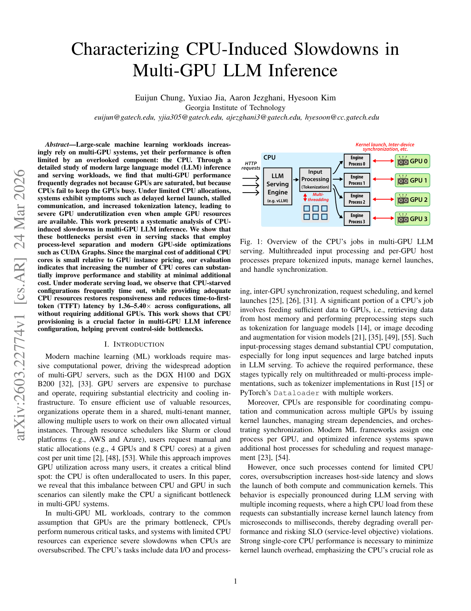
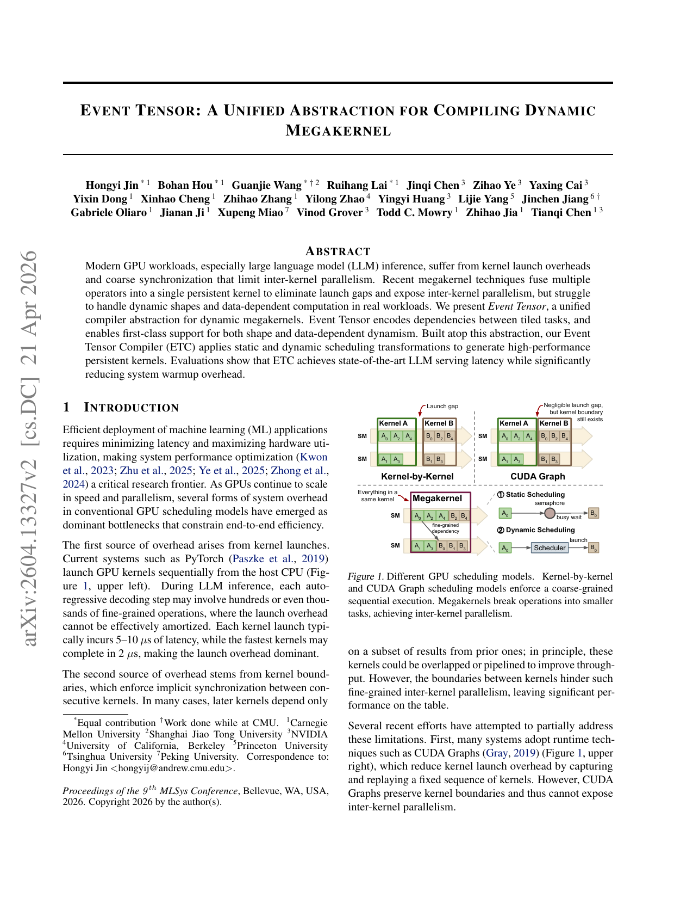
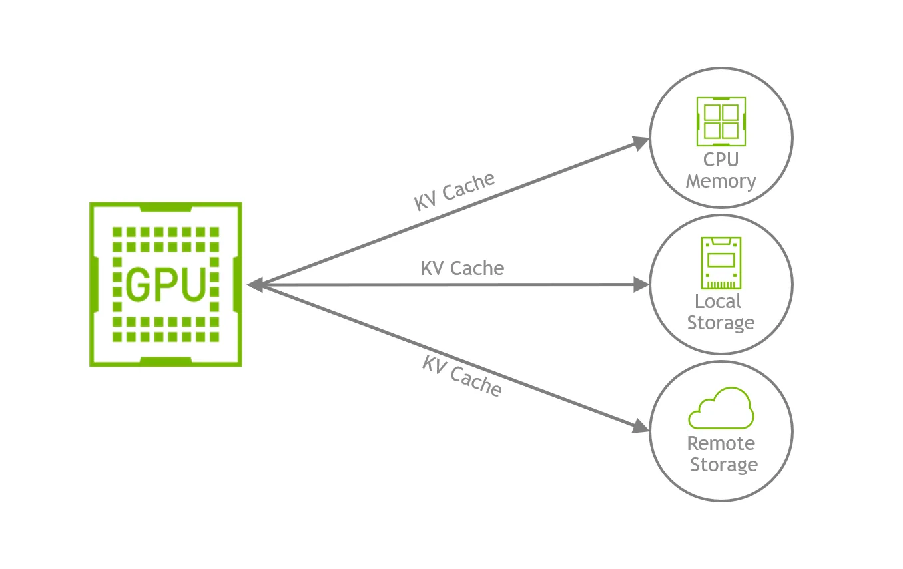
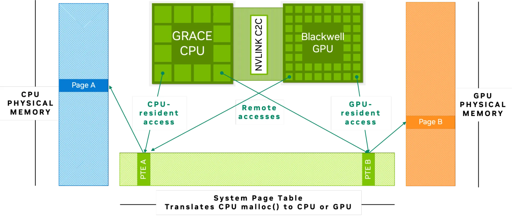
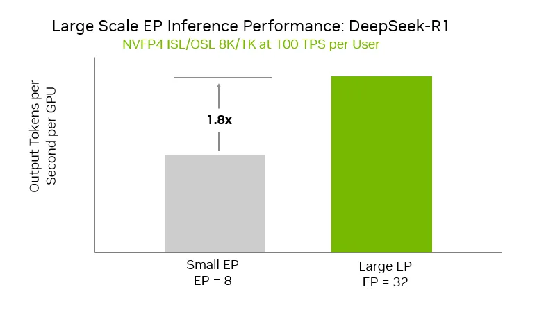
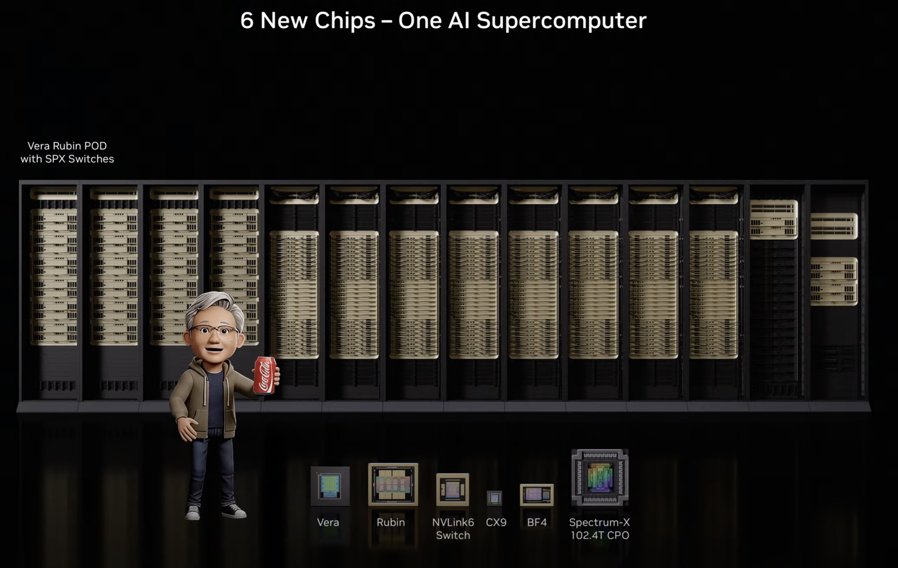
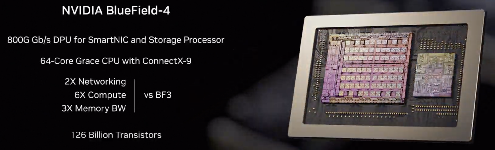
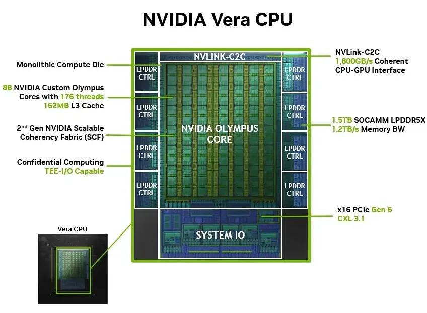

# Agentic AI 推理机头 CPU 综述：从 Host 到 Orchestrator

> **更新日期：** 2026-04-24  
> **资料时间边界：** 2025-07-01 及之后公开发表的论文、专利、产品发布与产业分析  
> **范围：** 聚焦 GPU 推理节点上的 host CPU / control-plane CPU（"机头 CPU"），不讨论训练场景；工具执行本身的 CPU 消耗仅在必要时作为背景。

---

## 摘要

Agentic AI 正在将推理系统的关键瓶颈从 GPU 计算逐步外溢到 host 侧编排链路。基于 2025 年下半年以来的 30 余份公开论文、厂商技术文档与产业分析，本文系统综述了机头 CPU 在 agentic AI 推理中的角色演化与系统影响。现有证据表明，机头 CPU 的核心功能已从传统 host 演化为 **inference orchestration layer**：其职责不再局限于 kernel launch，而扩展到请求接入、prefill/decode 切分、KV 保留与预取、跨节点传输、专家放置及多代理并发控制等多个方面。

本文将现有研究归纳为四条相互耦合的技术主线：
1. **算子下发与状态驱动调度**：权重量化越激进，"调度墙"越明显；CPU oversubscription 可使 dequeue 延迟放大 **19×**。
2. **KV 卸载与生命周期管理**：agentic 推理 cache hit 达 **85%–97%**，read/write ratio 高达 **11.7x**；CPU 内存已从 spill 层升级为 warm tier。
3. **MoE 推理与专家编排**：专家权重卸载使 CPU 成为路由与通信编排器；推测预取可将 TPOT 降低 **14%**。
4. **PD 分离与跨池编排**：PD 分离已成为生产默认架构；跨节点 KV 传输需 **90 Gbps+** 带宽。

与此同时，NVIDIA Vera CPU（88 核 / 1.2 TB/s LPDDR5X）、CXL 内存扩展、BlueField-4 DPU 等平台信号说明，硬件路线图正在围绕"CPU 作为 AI factory 控制平面"这一假设收敛。产业共识认为，传统 AI 数据中心 **1:4–1:8** 的 CPU:GPU 比例将向 **1:1–1:2** 演进。

---

## 1. 引言：Agentic AI 如何重新定义系统瓶颈

近两年，大模型推理系统的优化重点经历了显著迁移。早期工作主要关注 GPU 侧的算力利用率、注意力算子实现和显存容量边界；而在 agentic AI 兴起之后，系统行为从"单次请求、连续 decode"转向"多阶段推理、状态保留、外部中断、上下文复用与多代理并发"的复合执行模式。

Georgia Tech 与 Intel 的联合研究（2025-11）表明，典型 agentic 工作负载中工具处理占端到端延迟的 **50%–90.6%**；GPU 升级越快，瓶颈越迅速向 CPU 侧转移 [1]。NVIDIA 2026 年 4 月的 Dynamo agentic inference 数据则显示，在 agentic workload 中，后续调用的 cache hit 可达 **85%–97%**，4 个 teammate agent 聚合后可到 **97.2%**，累计 **read/write ratio 为 11.7x** [9]。这意味着系统的价值重心从"多写一点新 KV"转到"把旧状态留住、路由对、提前取回、避免重算"。

**图1** Agentic inference 的 KV 读写关系。累计读取明显快于累计写入，说明 agentic workload 的核心压力正从"持续写入新状态"转向"保留、路由、预取与恢复既有状态"。来源：NVIDIA, 2026-04-17 [9]。

本文基于 现有报告、图表与引用材料，将现有研究归纳为四条相互耦合的技术主线，并结合真实产品工作负载与平台演化信号，对机头 CPU 的角色、瓶颈与选型做出系统性判断。

---

## 2. 主线一：算子下发——从"发命令"到"编排状态机"

### 2.1 调度墙取代内存墙：一个反直觉的因果链

2026 年 3 月的一篇深度工程实测揭示了一个被忽视的新范式：当模型通过 IQ4/FP4 等激进量化手段被压缩到可完全驻留 GPU L2 Cache 时，内存带宽瓶颈消失，但**算子下发（Dispatch）瓶颈凸显**。一个 135M 参数的量化模型单次前向传播发射 301 个 Kernel，每个 Launch 约 2.5 μs，总计 **750 μs** 的纯下发税，几乎等于单 Token 总时间（792 μs）——占 **95%** [3]。Kernel Fusion 将发射次数降至 181 次后，吞吐提升 **20%**（1255 → 1508 tok/s）。

这一因果链对机头 CPU 的选型有直接影响：
- **量化降低显存压力 → 模型更小 → Batch 内可容纳更多请求 → Kernel 发射频率更高 → CPU 调度负载更重。**
- LongCat-Flash-Lite 论文（2026-01）同样观察到，在轻量模型 + 大有效 Batch Size 场景下，瓶颈从内存带宽转向 Kernel Launch Overhead [21]。
- FlashNorm（2026-04）的微观分析指出，单次 Kernel Launch 在 A100 上约 **10–15 μs**，加上中间张量分配（~5 μs）和 HBM 往返，每次融合可节省 **15–25 μs** 固定开销——这部分开销与模型规模无关，纯粹由 CPU 驱动栈决定。

### 2.2 CPU 竞争将微秒级开销放大为毫秒级集群停滞

《Characterizing CPU-Induced Slowdowns in Multi-GPU LLM Inference》（2026-03）系统量化了该问题 [2]：

- vLLM 在 H100 上运行 Llama 3 8B 时，HTTP 服务占 **33%** 执行时间，调度 + 输入准备占 **29%**，GPU 实际计算仅 **38%**。
- 当 CPU 进程数超过可用核心数时，Kernel Launch 延迟从 μs 级恶化到 ms 级；在 NCCL 集合通信中，若某一 Rank 的 CPU 被抢占 1 ms，所有 GPU 忙等放大为集群级停滞。
- vLLM 的 `shm_broadcast.py` 广播队列在 5 req/s、100k Token 输入的 TP=4 场景下，dequeue 延迟从 12 ms 恶化到 **228 ms**（**19×**），是 GPU 单步解码时间（44 ms）的 5 倍以上。

**图2** CPU 竞争对多 GPU LLM 推理的影响。实验显示 CPU oversubscription 可使 dequeue 延迟放大 19 倍，GPU 计算仅占端到端时间的 38%。来源：arXiv:2603.22774 [2]。

### 2.3 推理引擎层面的 CPU 优化——以 vLLM V1 为例

2025 年 1 月发布的 vLLM V1 是一次针对机头 CPU 开销的系统性重构 [5]：
- **Persistent Batch**：缓存输入张量，每步仅应用增量 diffs，避免每步重建张量的 Python 开销。
- **Numpy 替代 Python Native**：在调度器与数据准备路径上用 Numpy 操作替代原生 Python，显著降低 CPU 占用。
- **Zero-Overhead Prefix Caching**：即使 Cache 命中率为 0%，吞吐损失也 < 1%，消除了 V0 中因前缀缓存数据结构导致的 CPU 瓶颈。
- **Piecewise CUDA Graphs**：在保持动态调度能力的同时，尽可能捕获静态子图的 CUDA Graph，减少重复 Kernel Launch。

实测显示，V1 在文本模型上吞吐比 V0 提升最高 **1.7×**；在视觉语言模型上提升更为显著。vLLM 2026 Q1 Roadmap 进一步将 "Python overhead reduction"、"CPU KV cache production ready" 与 "disaggregated prefilling" 列为重点，表明社区已明确意识到机头 CPU 是下一阶段的优化主战场。

### 2.4 持久化 Kernel：从软件优化到编译层面消除 Launch 开销

Event Tensor（2026-04，MLSys 审稿）将动态控制流编码为 Tile 级依赖图，生成跨算子的持久化 Megakernel，从根本上消除跨 Kernel 边界同步与 Launch 开销 [4]。这是从"减少 Launch 次数"到"彻底消除 Launch 边界"的范式跃迁，标志着算子下发优化已进入编译器与运行时协同设计阶段。

**图3** Event Tensor 将动态形状与数据依赖编码为 Tile 依赖图，生成 Persistent Kernel。来源：arXiv:2604.13327 [4]。

---

## 3. 主线二：KV 卸载——从"容量兜底"到"生命周期管理"

### 3.1 Agentic AI 把 KV 访问模式推向 write-once-read-many

在传统聊天式推理中，KV cache 往往随单轮请求生命周期结束而失去价值；在 agentic AI 中，会话状态、工具定义和中间推理上下文可能在长时间内持续复用。NVIDIA Dynamo 数据显示 [9]：

| 指标 | 数值 |
|---|---|
| 同一 worker 后续调用 cache hit | **85%–97%** |
| 4 个 teammate agent 聚合 cache hit | **97.2%** |
| 累计 read/write ratio | **11.7x** |

这些数据表明，在 agentic AI 中，系统压力正从"频繁写入新 KV"转向"如何保留、共享、路由和预取旧 KV"。

### 3.2 分层 KV 存储：CPU 内存升级为 warm tier

NVIDIA 2025-09-18 的 Dynamo KV 文章将 KV offload 明确扩展到 CPU RAM、local SSD 和 remote/network storage [8]。这一定位转变说明，工业界已不再把 KV offload 看成"GPU 内存不够时的临时 spill"，而是把它当成**层次化容量与共享架构**。

**图4** NVIDIA 给出的 KV offloading 架构图，强调 GPU 可把 KV 转移到更大、更便宜的存储层。来源：NVIDIA, 2025-09-18 [8]。

Grace Hopper / Grace Blackwell 通过 **NVLink-C2C 900 GB/s** 的 coherent interconnect 共享统一内存地址空间 [10]。这类设计的意义在于：
- CPU 内存可作为低摩擦的 KV staging / overflow / sharing 层
- GPU 不必每次显式复制与迁移数据
- 长会话、长上下文和 pause-resume 工作流的恢复路径更短

**图5** CPU 与 GPU 通过统一页表共享内存地址空间，使 host memory 更自然地成为 KV 的延伸容量层。来源：NVIDIA, 2025-09-05 [10]。

### 3.3 稀疏化 + 卸载：2025H2 以来的主攻方向

- **NOSA（2025-10，arXiv）**：首个"原生为 KV Cache Offloading 设计"的可训练稀疏注意力机制。它显式约束 CPU-GPU KV 传输量，在 1B/3B/8B 模型上相比全注意力实现最高 **5.04×** 解码吞吐提升，相比 InfLLMv2 和 ShadowKV 分别提升 **1.92×** 和 **1.83×** [6]。

**图6** NOSA 架构：原生为 KV offloading 设计的稀疏注意力机制，显式约束跨设备传输量。来源：arXiv:2510.13602 [6]。

- **ScoutAttention（2026-03，arXiv）**：提出 Layer-Ahead CPU Pre-computation 算法，让 CPU 提前一层启动 Attention 计算，并通过异步周期性召回机制保持极低 CPU 负载。在保持精度损失 < **2.4%** 的前提下，相比现有卸载方法实现 **2.1×** 加速 [7]。

**图7** ScoutAttention 让 CPU 提前一层预计算 Attention，异步召回。来源：arXiv:2603.27138 [7]。

- **CoMEM（2025，OpenReview）**：针对 Agentic 长上下文，将历史压缩任务卸载到轻量级异步记忆模型，通过 k-step-off Pipeline 重叠记忆摘要与 Agent 执行，解码开销降低 **1.4×**。

### 3.4 CXL 内存扩展：从技术问题到经济问题

Astera Labs 的 Leo CXL Smart Memory Controller（2025-11 实测数据）显示，在生产级 LLM 推理负载中 [15]：

| 指标 | 改善 |
|---|---|
| GPU 需求降低 | **87%** |
| Prefill 阶段 GPU 利用率提升 | **75%** |
| 每查询 CPU 利用率降低 | **40%** |
| 并发 LLM 实例支持 | **2×** |

**图8** CXL 内存扩展在生产级 LLM 推理负载中的建模数据。来源：Astera Labs, 2025-11 [15]。

这意味着 CXL 正在创造一种介于 GPU HBM 与主机 DRAM 之间的"内存带宽缓冲层"，对 KV 卸载场景具有直接的经济学意义。机头 CPU 的角色已从"数据搬运工"升级为 **tier placement manager、prefetch coordinator、resume latency controller**。

### 3.5 预取：agentic AI 的关键补充机制

与传统 offload 不同，agentic AI 的工作流经常具备可预测性。Agent harness 往往知道工具调用何时可能返回，因此可以提前推测"下一次请求将需要哪些 KV 块"。这使得 `prefetch` 从存储系统中的常见优化，上升为推理生命周期管理的核心机制。

**图9** 工具调用后，KV 先被卸到主机/存储侧，再在第二次 LLM 调用前主动预取回 GPU。对 agentic AI 来说，预取和卸载是成对出现的。来源：NVIDIA, 2026-04-17 [9]。

---

## 4. 主线三：MoE 推理——从"稀疏计算优势"到"host-side orchestration 压力"

### 4.1 MoE 的效率收益并不自动转化为系统收益

MoE 通常被理解为"以更少的激活计算获得更大模型能力"，但这一说法忽略了系统代价。以 DeepSeek-R1（671B 总参 / 37B 激活参）为例，单节点 GPU 无法容纳全部专家权重 [21]。当专家权重被卸载到 CPU 内存时，每次 Token 路由命中冷专家都会触发同步 CPU→GPU 拷贝，成为解码阶段的决定性瓶颈。

Mixtral-8x7B 中每个 Token 可访问 47B 总参数，但仅 13B 参与计算，实现约 **3.6×** 的激活计算削减。这种"稀疏激活"特性使 MoE 在推理时具有天然效率优势，但也引入了独特的 host-side 复杂性。

### 4.2 2026 年的主要突破：推测预取与驻留解耦

- **Speculating Experts（2026-03，arXiv）**：利用当前层已计算的内部表示（归一化残差流 + 默认向量）推测下一层将激活的专家，实现权重预取与 GPU 计算的重叠。在 Qwen-30B-A3B 等模型上，相比按需加载实现 **14%** 的 TPOT 降低 [11]。

**图10** Speculating Experts 利用内部表示推测未来专家，重叠 CPU-GPU 传输与计算。来源：arXiv:2603.19289 [11]。

- **FluxMoE（2026-04，arXiv）**：解耦"逻辑专家身份"与"物理驻留位置"，通过带宽均衡的存储层次（压缩 GPU 内存 + 主机 DRAM）动态流式化参数，摆脱对路由预测准确率的依赖 [12]。

**图11** FluxMoE 解耦逻辑专家身份与物理驻留位置，动态流式化参数。来源：arXiv:2604.02715 [12]。

- **中国科学技术大学专利（2025，CN）**：提出异步并行推理方法，将 GPU 计算与 Expert Parallelism 固有的 All-to-All 通信解耦，允许 Token 数据通信与模型计算异步并行；同时策略性将热点专家常驻 GPU、冷点专家卸载 CPU。

### 4.3 CPU 在 MoE 中的三重负载

1. **权重搬运**：PCIe / C2C 带宽有限，CPU 负责将专家权重从主机内存拷贝到 GPU。
2. **路由协调**：All-to-All 集合通信的同步信号由 CPU 侧进程驱动；若任一 Rank 的 CPU 延迟，全网 GPU 等待。
3. **负载均衡与调度**：动态专家剪枝、容量因子调整、冷热专家分级策略均需在 CPU 侧实时决策。

NVIDIA Wide EP（2025-12）进一步将 MoE host 压力从"单请求驱动"推向"批级路由 + 跨节点通信拓扑编排" [28]。MoE 推理的关键已扩展到 expert 路由、放置和跨 GPU 通信拓扑。

**图12** NVIDIA wide expert parallelism 示意图，强调 MoE 推理的关键已经扩展到 expert 路由、并行放置和通信拓扑。来源：NVIDIA, 2025-12-18 [28]。

---

## 5. 主线四：PD 分离——从"单节点调度器"到"跨池编排中枢"

### 5.1 PD 分离已成为生产默认架构

2024 年的 DistServe 与 Splitwise 首次系统论证了 PD 分离的收益，而到 2025 年底，Hao AI Lab 的回顾性分析确认该架构已成为"几乎每个主要 LLM 服务栈的默认手册"。vLLM、SGLang、NVIDIA Dynamo、TensorRT-LLM 与 llm-d 均已原生支持 PD 分离。

2026-03-23 的 NVIDIA Kubernetes 文章把 `disaggregated LLM inference` 明确拆成 `ingress-router`、`prefill worker`、`decode worker`，并用 NIXL 负责节点间高吞吐数据传输 [22]。

**图13** NVIDIA 在 Kubernetes 上展示的解耦式推理拓扑。host 侧职责从"单机发命令"扩展为 router + stage scheduling + transfer orchestration。来源：NVIDIA, 2026-03-23 [22]。

### 5.2 KV Cache 传输开销高度依赖 CPU 侧网络栈与调度效率

- **同节点 NVLink**：DistServe 报告传输开销 < 总服务时间的 **0.1%**，可忽略。
- **跨节点网络**：Splitwise 计算表明，OPT-66B 在 512 Token 输入下产生约 **1.13 GB** KV Cache；若请求率达到 10 req/s，需约 **90 Gbps** 带宽才能避免瓶颈。
- **llm-d 0.5（2026-02）的 UCCL Backend**：采用 host-resident software transport stack，由 CPU 管理传输逻辑而非完全依赖硬件卸载，在网络拥塞下尾延迟恶化仅 **7.1%**（对比 UCX 的 **17.1%**），验证了机头 CPU 在拥塞控制中的关键作用。

### 5.3 Agentic 长交互进一步放大 CPU 调度压力

Agentic 工作负载通常表现为**短输入 + 极长输出**（多轮工具调用后的推理链），这意味着 decode 阶段持续时间远超 prefill。PD 分离后，decode 池需要长时间维持大量并发流的 KV Cache 状态，而 prefill 池则需快速处理频繁到达的新工具调用结果。机头 CPU 的调度器必须在两个池之间做动态负载均衡，并处理 KV Cache 的跨池预热、迁移与回收。

---

## 6. 真实工作负载补出的三项遗漏

底层 serving 论文容易假设"单上下文、长 decode、纯文本输入"，但真实 agentic 产品形态修正了这些假设：

| 产品形态 | 核心特征 | 对机头 CPU 的修正 |
|---|---|---|
| **OpenClaw / 豆包 Mobile Use Agent** | 多模态截图输入 + 高频短回合切换 | CPU 压力从长 decode 推向 **高频 prefill + 高频状态切换** |
| **Claude Code subagents** | 独立 context window，多上下文并行 | 瓶颈不是单上下文超长，而是 **同时活跃的上下文条目太多**（session multiplicity） |
| **Kimi Agent Swarm（100 sub-agents）** | 极宽瞬时并发，fan-out/fan-in | CPU 需要 **burst handling** 能力，而非只看长期平均吞吐 |

**综合推断**：agentic LLM inference 对机头 CPU 的新增要求，除了 KV tiering 和 transfer，还包括 **高频 prefill 调度、多上下文并存管理、极宽 fan-out/fan-in、多模态 ingress 编排**。

---

## 7. 平台信号：硬件路线图正在围绕 CPU 控制平面收敛

### 7.1 NVIDIA Vera CPU — 专为 Agentic 推理设计的机头处理器

2026 年 3 月 GTC 上，NVIDIA 将 Vera CPU 从"GPU 附属品"重新定位为可独立部署的 Agentic 编排核心。这是本次洞察最具标志性的产品信号 [13][14][17]：

- **核心规格：** 88 颗定制 Olympus Armv9.2 核心，支持 NVIDIA Spatial Multithreading（SMT），单芯片 2270 亿晶体管；LPDDR5X 内存带宽达 **1.2 TB/s**；NVLink-C2C 与 GPU 互联带宽 **1.8 TB/s**。
- **Agentic 定位：** NVIDIA 官方将 Vera 定义为"AI Factories 的控制平面"，强调其在沙箱执行、RL 后训练反馈循环中的低尾延迟表现，相比竞品沙箱性能提升 **50%**。
- **独立商业模式：** Meta 已签署大规模 Grace-only 部署协议并计划 2027 年引入 Vera；CoreWeave、Oracle、Alibaba、ByteDance 等云厂商将在 2026 下半年提供 standalone Vera CPU 实例。

**图14** NVIDIA Vera CPU 架构与关键指标。88 颗 Olympus 核心与 1.2 TB/s LPDDR5X 内存带宽使其成为当前面向 Agentic AI 编排密度最高的机头 CPU 之一。来源：NVIDIA GTC 2026 [13]。

**图15** Vera Rubin 平台采用"极端协同设计"，将 Vera CPU、Rubin GPU、NVLink 6 Switch、ConnectX-9、BlueField-4 DPU 与 Spectrum-6 以太网交换机构建为统一系统。来源：StorageReview, 2026 [14]。

### 7.2 BlueField-4 / SuperNIC — 卸载网络、存储与安全

BlueField-4 集成 64 核心 CPU 与 ConnectX-9 SuperNIC，将网络、存储和安全处理从 Vera CPU 与 Rubin GPU 上卸载，使机头 CPU 能专注于 Agentic 编排与 Kernel 调度 [14]。

**图16** BlueField-4 集成 64 核心 CPU 与 ConnectX-9 SuperNIC，将网络、存储和安全处理从 Vera CPU 与 Rubin GPU 上卸载。来源：StorageReview, 2026 [14]。

### 7.3 CPU:GPU 配比结构性翻转

产业共识（NVIDIA GTC 2026、TrendForce、Arm）认为，传统 AI 数据中心 1:4–1:8 的 CPU:GPU 比例将向 **1:1–1:2** 演进；每 GW 所需 CPU 核心从 3000 万增至 **1.2 亿**（**4×**） [16][18][19][20]。

**图17** TrendForce 分析显示 Agentic AI 正在重塑 CPU:GPU 比例。来源：TrendForce, 2026-04 [16]。

### 7.4 机头 CPU 产品横向对比

截至 2026 年 Q2，三大厂商均发布了面向 Agentic AI 推理的机头 CPU 方案：

| 指标 | NVIDIA Vera | AMD EPYC Turin | Intel Xeon 6 Granite Rapids |
|---|---|---|---|
| **核心架构** | 88 核 Olympus (Armv9.2) | 最高 192 核 Zen 5 | 最高 128 核 P-core |
| **内存带宽** | **1.2 TB/s** LPDDR5X (~14 GB/s/核) | ~614 GB/s DDR5 (~3.2 GB/s/核) | ~307 GB/s DDR5 (~2.4 GB/s/核) |
| **GPU 互联** | NVLink-C2C **1.8 TB/s** | PCIe Gen5 x128 | PCIe Gen5 |
| **Agentic 实测** | 沙箱性能 **1.5×** 于 x86；Redpanda cross-core 吞吐 **+73%** | 32 核后带宽饱和扩展平坦 | 单核频率 5.0–5.7 GHz，延迟敏感型占优 |
| **独立部署** | 已确认 standalone 商业模式 | 传统服务器市场主导 | 受 18A 良率影响量产或延至 2027 |

**关键洞察：**
- **Vera** 的优势在于单芯片统一内存域 + 极高每核带宽，对 Kernel Launch 密集、KV Cache 调度的 Agentic 负载极为适配。
- **AMD Turin** 仍是核心密度与 TCO 冠军，每美元吞吐量最高，但 Chiplet 架构跨 CCD 通信存在 NUMA 延迟。
- **Intel Granite Rapids** 单核频率最高，在 tokenization、JSON 解析、API 序列化等串行任务上仍有优势。

### 7.5 机头 CPU 选型分层建议

| 节点类型 | 首选平台 | 关键理由 |
|---|---|---|
| **GPU 伴随型推理节点**（co-located） | NVIDIA Vera（或 Grace） | NVLink-C2C 1.8 TB/s + 统一内存地址空间，KV reload/prefetch 路径最短 |
| **通用推理网关 / 纯 CPU 编排节点** | AMD EPYC Turin | 192 核密度 + 成熟软件生态 + 最优 TCO |
| **极致延迟敏感型边缘节点** | Intel Xeon 6 Granite Rapids | 5.0–5.7 GHz 单核频率，tokenization/API 解析尾延迟最低 |
| **容量优先型 KV 存储节点** | EPYC Turin + CXL 扩展 | 大容量 DRAM + CXL Memory Pooling，分层经济性最佳 |

---

## 8. 讨论：现有研究的共识与不足

### 8.1 当前较稳健的共识

基于 现有材料，至少可形成以下较稳健的共识：

1. **机头 CPU 已进入推理关键路径。** 无论从 PD 分离、KV 生命周期管理、MoE 编排还是真实 agent workload 看，CPU 已不是外围组件。
2. **CPU 瓶颈的本质不是"算得慢"，而是"编排链路太长"。** 真正的问题集中在 dispatch、queue、state、transfer、placement、resume，而不是单纯 host FLOPS。
3. **KV 卸载的核心问题已从容量转向生命周期和分层经济性。** warm tier 应该放在 coherent CPU memory、host DRAM 还是 CXL memory，已经成为架构选择题。
4. **MoE 会持续抬高 host-side orchestration 的价值。** 稀疏计算节省的 GPU 算力，会换来更重的 expert routing、residency 和 communication management。
5. **未来选型应按节点角色分层，而不是只按 CPU 品牌分层。**

### 8.2 仍然缺失的部分

- **缺少统一的机头 CPU 基准**：当前材料能证明 CPU 重要，但缺乏一个被行业普遍接受的 `agentic inference host benchmark`。
- **产品 workload 与底层机制之间仍有证据断层**：像 OpenClaw、Claude Code、Kimi Swarm 这类真实产品，很适合反推 host 压力，但它们未必公开了足够细的系统指标。
- **平台信号强，但长期通用性仍待验证**：Vera / Rubin / BlueField-4 明显给出了方向，但这些平台的实际普及度、软件栈成熟度、与通用 x86 方案的长期对比，还需要更多独立部署证据。

---

## 9. 结论

如果只把 agentic AI 看成"更会用工具的 LLM"，就会低估机头 CPU 的系统意义。现有材料更一致地说明了另一件事：

**Agentic AI 推理正在把计算问题，重新变回一个系统编排问题。**

在这个问题里，GPU 仍然负责最昂贵的矩阵运算，但真正决定系统是否高效运转的，越来越是机头 CPU 能否把请求、状态、KV、专家、网络和平台资源编排成一条低抖动的控制链路。

因此，对 agentic AI 而言，机头 CPU 不应再被理解为"GPU 旁边那颗普通服务器 CPU"，而应被理解为：

> **推理系统中的 orchestration layer in silicon。**

如果你的服务已经出现下面任一迹象，就不该再把 host CPU 当成配角：

- GPU 利用率起伏很大，但显存和 FLOPS 并未打满
- 多阶段 resume 的尾延迟明显高于纯 decode
- KV 命中率高，但端到端时延改善不成比例
- MoE 扩容后吞吐没按 GPU 数线性增长
- K8s / runtime / transfer sidecar 一开就吃掉大量 host core
- 引入多模态输入后，prefill 延迟显著增加但 GPU 计算时间未变
- subagent 或 swarm 并发时，调度延迟出现阶跃式恶化

---

## 参考文献

[1] RAJ R, et al. Towards understanding, analyzing, and optimizing agentic AI execution: a CPU-centric perspective[EB/OL]. arXiv:2511.00739, 2025. https://arxiv.org/abs/2511.00739.

[2] Characterizing CPU-induced slowdowns in multi-GPU LLM inference[EB/OL]. arXiv:2603.22774, 2026. https://arxiv.org/abs/2603.22774.

[3] What actually bottlenecks LLM inference on modern GPUs[EB/OL]. AI.rs, 2026. https://ai.rs/ai-developer/memory-wall-disappears-llm-inference-bottlenecks.

[4] Event Tensor: dynamic megakernels for LLM serving[EB/OL]. arXiv:2604.13327, 2026. https://arxiv.org/abs/2604.13327.

[5] vLLM Project. vLLM V1 alpha release and subsequent public roadmap materials[EB/OL]. 2025-2026.

[6] HUANG Y, et al. NOSA: native and offloadable sparse attention[EB/OL]. arXiv:2510.13602, 2025. https://arxiv.org/abs/2510.13602.

[7] ZHANG Q, et al. ScoutAttention: efficient KV cache offloading via layer-ahead CPU pre-computation[EB/OL]. arXiv:2603.27138, 2026. https://arxiv.org/abs/2603.27138.

[8] NVIDIA. How to reduce KV cache bottlenecks with NVIDIA Dynamo[EB/OL]. 2025. https://developer.nvidia.com/blog/how-to-reduce-kv-cache-bottlenecks-with-nvidia-dynamo/.

[9] NVIDIA. Full-stack optimizations for agentic inference with NVIDIA Dynamo[EB/OL]. 2026. https://developer.nvidia.com/blog/full-stack-optimizations-for-agentic-inference-with-nvidia-dynamo/.

[10] NVIDIA. Accelerate large-scale LLM inference and KV cache offload with CPU-GPU memory sharing[EB/OL]. 2025. https://developer.nvidia.com/blog/accelerate-large-scale-llm-inference-and-kv-cache-offload-with-cpu-gpu-memory-sharing/.

[11] Speculating experts accelerates inference for mixture-of-experts[EB/OL]. arXiv:2603.19289, 2026. https://arxiv.org/abs/2603.19289.

[12] FluxMoE: decoupling expert residency for high-performance MoE serving[EB/OL]. arXiv:2604.02715, 2026. https://arxiv.org/abs/2604.02715.

[13] NVIDIA. NVIDIA Vera CPU delivers high performance, bandwidth, and efficiency for AI factories[EB/OL]. 2026. https://developer.nvidia.com/blog/nvidia-vera-cpu-delivers-high-performance-bandwidth-and-efficiency-for-ai-factories/.

[14] StorageReview. NVIDIA launches Vera Rubin architecture at CES 2026[EB/OL]. 2026. https://www.storagereview.com/news/nvidia-launches-vera-rubin-architecture-at-ces-2026-the-vr-nvl72-rack.

[15] Astera Labs. How CXL transforms RAG and KV cache performance[EB/OL]. 2025. https://www.asteralabs.com/breaking-through-the-memory-wall-how-cxl-transforms-rag-and-kv-cache-performance/.

[16] TrendForce. How agentic AI is reshaping the CPU:GPU ratio[EB/OL]. 2026. https://insights.trendforce.com/p/agentic-ai-cpu-gpu.

[17] Data Center Dynamics. NVIDIA Vera CPU enters full production, pitched at agentic AI workloads[EB/OL]. 2026. https://www.datacenterdynamics.com/en/news/nvidia-vera-cpu-enters-full-production-pitched-at-agentic-ai-workloads/.

[18] The Diligence Stack. Secret agent CPU[EB/OL]. 2026. https://thediligencestack.com/p/secret-agent-cpu.

[19] rmmod. In the age of agentic, the CPU is the new bottleneck[EB/OL]. 2026. https://rmmod.com/posts/agent/agentic-cpu-bottleneck/.

[20] Uncover Alpha. The forgotten chip: CPUs the new bottleneck of the agentic AI era[EB/OL]. 2026. https://www.uncoveralpha.com/p/the-forgotten-chip-cpus-the-new-bottleneck.

[21] Zylos Research. AI inference optimization techniques (2025-2026)[EB/OL]. 2026. https://zylos.ai/research/2026-01-11-ai-inference-optimization.

[22] NVIDIA. Deploying disaggregated LLM inference workloads on Kubernetes[EB/OL]. 2026. https://developer.nvidia.com/blog/deploying-disaggregated-llm-inference-workloads-on-kubernetes/.

[28] NVIDIA. Scaling large MoE models with wide expert parallelism on NVL72 rack-scale systems[EB/OL]. 2025. https://developer.nvidia.com/blog/scaling-large-moe-models-with-wide-expert-parallelism-on-nvl72-rack-scale-systems/.

---

> **免责声明：** 本综述基于 2025-07-01 至 2026-04-24 期间公开发表的技术论文、厂商公告、开源项目演进与产业分析整理而成。涉及尚未量产的产品时间表存在延期风险；性能数据来源于论文、厂商受控测试或第三方早期 benchmark，实际部署收益取决于具体工作负载与系统配置。
