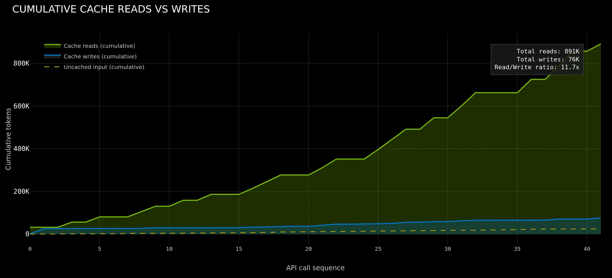
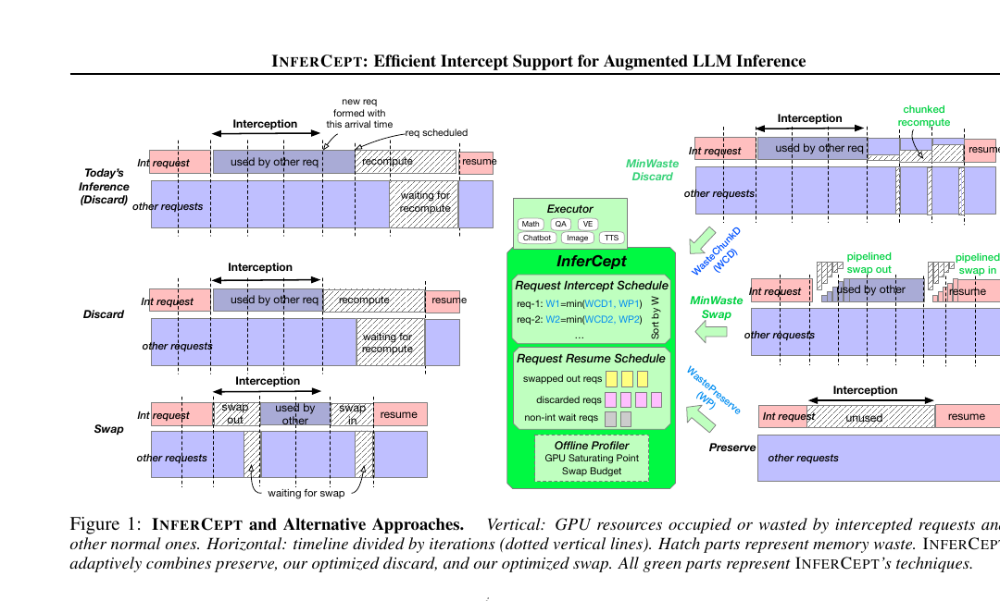

# Agentic AI 场景下 KV 卸载的系统综述

> Updated: 2026-04-24  
> Scope: 综述 `agentic AI` 工作负载如何改变 `KV cache offloading` 的访问模式、系统瓶颈与分层架构，并讨论这些变化对 CPU 设计的启示。本文重点覆盖 2024-2026 的公开论文与厂商技术资料，尤其关注 `pause-resume`、多 agent 扇出、分层 KV 存储、预取与 CPU 侧内存通路。

## 摘要

Agentic AI 正在改变大模型推理系统对 KV cache 的处理方式。与传统聊天式推理相比，agentic workload 具有更长的会话生命周期、更频繁的工具调用与中断恢复、更高的前缀共享度，以及更显著的跨请求 KV 复用需求。这些特征使 KV 卸载从“GPU 显存不足时的补救机制”演化为支撑吞吐、时延与成本优化的核心系统能力。本文综述了 2024-2026 年公开研究与工业实践中关于 agentic AI、KV 卸载、共享前缀复用、暂停恢复、分层存储和 CPU-GPU 协同内存的主要进展。综述表明，agentic AI 将 KV 访问模式显著推向 `write-once-read-many`，并强化了 `preserve / swap / prefetch / routing-aware reuse` 等机制的重要性。相应地，CPU 不再只是慢速 spill 目的地，而逐渐成为 GPU 之外的首层可用容量与共享层。本文最后从主机侧带宽、页表与 pinning 成本、分层内存语义、异步预取和轻量数据变换等方面，总结其对 CPU 设计的主要启示。

## 1. 引言

随着 coding agent、research agent、browser agent 和 tool-using assistant 的快速普及，推理系统正从“单轮生成”转向“长生命周期、多阶段、可中断、可恢复、可共享”的工作模式。在这类场景中，模型已生成上下文所形成的 KV cache 不再只是一次请求的临时状态，而是跨多次调用、跨多个 worker、甚至跨多个 agent 共享的系统资源。

这一变化直接抬高了 KV 卸载的重要性。过去，KV offload 的主要目标是缓解 GPU 显存压力、支持更长上下文；而在 agentic AI 场景下，它还承担了避免重算、降低冷启动成本、支撑多 agent 前缀共享、提升中断恢复效率等额外职责。因此，理解 agentic AI 对 KV 卸载带来的差异化影响，已经成为评估未来 CPU、内存与异构系统设计的重要前提。

## 2. 概念与问题边界

### 2.1 KV 卸载的定义

KV 卸载是指把原本常驻 GPU 显存的 key-value cache 迁移到 CPU 内存、本地 SSD 或远端存储，并在后续请求中按需重新加载，以换取更高并发、更长上下文支持或更低重算成本。其本质是把 KV cache 从单层显存对象改造成跨层次、可迁移、可调度的数据结构。

### 2.2 Agentic AI 与传统聊天式推理的差异

传统聊天式推理通常具有较短生命周期、较低中断频率和较弱前缀共享；而 agentic AI 带来三类显著变化：

- **多轮长会话**：上下文持续累积，KV 生命周期显著延长。  
- **工具调用与暂停恢复**：外部工具、环境响应和人类反馈会频繁打断生成。  
- **多 agent 扇出与共享前缀**：主 agent 与子 agent 往往共享 system prompt、tool definitions 和会话前缀。  

### 2.3 本文关注的问题

本文聚焦三个问题：

1. agentic AI 如何改变 KV cache 的访问模式与生命周期？  
2. 当前公开系统如何处理 pause-resume、共享前缀、KV 分层与预取？  
3. 这些变化对 CPU 的内存、互连和系统角色提出了哪些启示？  

## 3. Agentic AI 改变 KV 访问模式

### 3.1 从短时状态到共享状态

在 agentic 场景中，首轮请求生成的 KV 往往会在后续几十次甚至上百次调用中持续复用。例如，coding agent 会在同一会话中反复携带相同的 system prompt、工具定义、项目上下文和中间结果。这样一来，KV cache 的价值不再由“单次 decode 的命中收益”决定，而更多由其 **跨请求、跨阶段的复用价值** 决定。

### 3.2 从写后少量读到 write-once-read-many

NVIDIA 在 2026-04-17 发布的 `Full-Stack Optimizations for Agentic Inference with NVIDIA Dynamo` 中指出，agentic inference 呈现出明显的 `write-once-read-many (WORM)` 特征。文中给出：

- 同一 worker 上后续调用 **85%-97% cache hit**  
- 4 个 agent teammate 聚合后 **97.2% cache hit**  
- **11.7x read/write ratio**

这些数据表明，在 agentic AI 中，系统压力正从“频繁写入新 KV”转向“如何保留、共享、路由和预取旧 KV”。

图：在 agentic inference 中，累计 KV 读取明显快于写入，反映出共享前缀和多次复用带来的 WORM 模式。  
来源：NVIDIA《Full-Stack Optimizations for Agentic Inference with NVIDIA Dynamo》。

### 3.3 中断恢复成为常态

Agentic AI 并非连续生成到底，而是频繁经历“生成一段 -> 调工具 -> 等返回 -> 继续生成”的模式。这使得 KV 在暂停期间虽然暂时不用，但恢复时又必须快速可用。由此，系统必须决定是：

- 丢弃 KV，恢复时重算  
- 保留 KV，等待恢复  
- 交换到 CPU/外存，再在恢复时取回  

也正是在这一点上，agentic AI 与传统推理系统的差异最为明显。

## 4. 主要系统路线与研究进展

### 4.1 丢弃、保留与交换：INFERCEPT 对中断处理的分析

INFERCEPT（2024）直接研究了 augmented / intercepted LLM inference。论文指出，现有系统往往把 interception 当作请求结束，恢复时重新发起请求并重算上下文；这种 `Discard` 策略会带来明显浪费。论文测得：

- **37%-40%** 的总模型 forwarding 时间会浪费在已算过上下文的重算上  
- 其改进系统可实现 **1.6x-2x** 的吞吐提升，并完成 **2x 更多请求/秒**

INFERCEPT 的贡献在于把 `Discard`、`Preserve`、`Swap` 与自适应调度放在同一框架中比较，从而说明：在 agentic 场景中，KV 不只是缓存对象，更是中断恢复语义的一部分。

图：INFERCEPT 对比了 `Discard`、`Swap`、`Preserve` 与自适应策略。它说明 agentic/augmented LLM 的核心不只是生成，而是如何在中断期间处理已存在的 KV。  
来源：INFERCEPT 论文 Figure 1。

### 4.2 分层 KV 存储：从本地显存管理到跨层次系统

NVIDIA 2025-09-18 的 `How to Reduce KV Cache Bottlenecks with NVIDIA Dynamo` 将 KV offload 明确扩展到：

- CPU RAM  
- local SSD  
- remote/network storage  

这一表述值得注意，因为它意味着工业界已不再把 KV offload 看成“GPU 内存不够时的临时 spill”，而是把它当成 **层次化容量与共享架构**。在长会话、高并发、共享模板或研究型工作流中，offload 的收益不止来自节省显存，还来自减少重算和提升共享命中率。

图：NVIDIA 给出的 KV offloading 架构图，强调 GPU 可把 KV 转移到更大、更便宜的存储层。  
来源：NVIDIA《How to Reduce KV Cache Bottlenecks with NVIDIA Dynamo》。

### 4.3 共享前缀与状态感知调度

Preble（2024）研究的是 distributed prompt scheduling，但其发现与 agentic AI 高度相关：随着 prompt 更长、共享前缀更多、请求状态更复杂，调度系统必须考虑状态放置和复用，而不能只按传统负载均衡逻辑分发请求。对于 agentic AI 而言，多 agent 扇出恰恰会放大这一问题，因为多个 subagents 经常共享同一套工具定义和系统上下文。

### 4.4 预取：agentic AI 的关键补充机制

与传统 offload 不同，agentic AI 的工作流经常具备可预测性。Agent harness 往往知道工具调用何时可能返回，因此可以提前推测“下一次请求将需要哪些 KV 块”。这使得 `prefetch` 从存储系统中的常见优化，上升为推理生命周期管理的核心机制。

图：工具调用后，KV 先被卸到主机/存储侧，再在第二次 LLM 调用前主动预取回 GPU。对 agentic AI 来说，预取和卸载是成对出现的。  
来源：NVIDIA《Full-Stack Optimizations for Agentic Inference with NVIDIA Dynamo》。

### 4.5 统一内存与 CPU-GPU 协同

NVIDIA 在 2025-09-05 的 `Accelerate Large-Scale LLM Inference and KV Cache Offload with CPU-GPU Memory Sharing` 中强调，Grace Hopper / Grace Blackwell 通过 **NVLink-C2C 900 GB/s** 的 coherent interconnect，将 CPU 与 GPU 放入统一内存地址空间。  

这类设计的意义不只是“让更大模型装下”，更在于：

- CPU 内存可作为低摩擦的 KV staging / overflow / sharing 层  
- GPU 不必每次显式复制与迁移数据  
- 长会话、长上下文和 pause-resume 工作流的恢复路径更短  

图：CPU 与 GPU 通过统一页表共享内存地址空间，说明 CPU 侧内存可以更自然地成为 KV 的延伸容量层。  
来源：NVIDIA《Accelerate Large-Scale LLM Inference and KV Cache Offload with CPU-GPU Memory Sharing》。

## 5. Agentic AI 对 KV 卸载带来的差异化影响

### 5.1 KV 生命周期显著延长

在普通聊天式推理中，KV 往往随单轮请求生命周期结束而失去价值；在 agentic AI 中，会话状态、工具定义和中间推理上下文可能在长时间内持续复用。因此，KV 的经济性从“短时命中”转向“长期保留后的多次复用”。

### 5.2 KV 卸载的收益从节省显存扩展到避免重算

普通聊天中，offload 主要服务于容量扩展；而在 agentic AI 中，它还用于：

- 保住工具调用前已生成的上下文  
- 在恢复时避免重新 prefill  
- 在多个 subagents 间共享前缀  

也就是说，offload 的价值不再只是“让模型放得下”，而是“让系统不必重复做已经做过的计算”。

### 5.3 路由与保留策略的重要性上升

由于 agentic workload 的前缀共享高、请求中断频繁，系统不仅要知道“KV 在哪里”，还要知道“哪些 KV 更值得保留”和“下一次请求最可能在哪个 worker 上运行”。这使 eviction policy、retention hint、TTL、priority queue 和 worker affinity 都成为关键议题。

### 5.4 CPU 从慢速兜底层变为温热容量层

当 KV 卸载主要面对长会话、pause-resume 和多 agent 共享前缀时，CPU 内存的角色会从“远端 spill 层”转向“GPU 外的首层温热容量层”。也就是说，CPU 内存不只是比 SSD 快，而是足够快到可以直接参与恢复、复用和预取。

## 6. 对 CPU 设计的启示

本文并不把这些结论视为“现成设计规范”，但基于公开资料，可以归纳出几项稳定的 CPU 设计启示。

### 6.1 主机侧带宽需要进入推理关键路径

如果 CPU 内存承担温热 KV 层，其价值就不再只是容量，而是 **能否在恢复路径中足够快地把 KV 送回 GPU**。因此，CPU-GPU 互连的峰值带宽固然重要，但更关键的是 tail latency、coherency 成本和可持续的数据流能力。

### 6.2 页表、pinning 与 IOMMU 成本会放大

KV block 大、数量多、生命周期长，agentic workload 又会引入频繁的暂停、恢复和复用。这意味着 pinned memory 管理、大页覆盖、TLB 效率、页表遍历和 IOMMU 映射更新，都会对系统表现产生更直接的影响。

### 6.3 分层内存语义会比单层 DRAM 更重要

对 agentic AI 而言，更合理的结构通常不是单一 DRAM，而是：

- GPU HBM：最热 KV  
- CPU DRAM：即将恢复、即将复用的温热 KV  
- SSD / remote / pooled memory：冷 KV、共享 KV 和持久 KV  

因此，NUMA、QoS、memory pooling 与未来 CXL.mem 的价值，会随着 agentic workload 的普及而提升。

### 6.4 预取与异步生命周期控制值得硬件友好支持

agentic AI 使“提前知道下一步会用到哪些 KV”成为可能，这使异步 copy、prefetch、DMA pipeline 和与软件协作的 lifecycle hint 更具价值。未来 CPU/SoC 在 supporting engine orchestration 上可能会出现更多面向 KV 语义的优化。

### 6.5 轻量数据变换路径的重要性提升

若未来 KV block 进一步压缩、量化、去重、哈希寻址，CPU 侧还会承担更多轻量数据变换任务，如 block hashing、checksum、压缩解压和热点前缀复制。这将提升向量化 memcpy、数据校验和小粒度数据变换的架构价值。

## 7. 文献与证据整理

| Year | Title | Type | Topic | Main finding | Relevance | Link |
| --- | --- | --- | --- | --- | --- | --- |
| 2024 | INFERCEPT: Efficient Intercept Support for Augmented Large Language Model Inference | 论文 | pause-resume / interception | 丢弃 KV 会导致 37%-40% 的前向时间浪费；INFERCEPT 提升 1.6x-2x 吞吐 | 直接说明 agentic/augmented workload 使 KV 保留与卸载成为核心问题 | https://arxiv.org/pdf/2402.01869 |
| 2024 | Preble: Efficient Distributed Prompt Scheduling for LLM Serving | 论文 | 共享前缀 / stateful scheduling | 长 prompt 与前缀共享让分布式调度必须考虑 state placement | 支撑 agentic 多 agent 共享前缀对 KV 系统的要求 | https://arxiv.org/pdf/2407.00023 |
| 2025 | Introducing New KV Cache Reuse Optimizations in NVIDIA TensorRT-LLM | 厂商技术文档 | KV eviction / retention | priority-based eviction 和 event API 可提升命中与路由能力 | 说明 KV 管理已从 LRU 转向 workload-aware 策略 | https://developer.nvidia.com/blog/introducing-new-kv-cache-reuse-optimizations-in-nvidia-tensorrt-llm/ |
| 2025 | How to Reduce KV Cache Bottlenecks with NVIDIA Dynamo | 厂商技术文档 | KV offload hierarchy | KV 可卸到 CPU RAM、SSD、network storage；适合长会话、高并发、共享内容 | 说明工业界已把 KV offload 视为层次系统 | https://developer.nvidia.com/blog/how-to-reduce-kv-cache-bottlenecks-with-nvidia-dynamo/ |
| 2025 | Accelerate Large-Scale LLM Inference and KV Cache Offload with CPU-GPU Memory Sharing | 厂商技术文档 | CPU-GPU unified memory | NVLink-C2C 900 GB/s coherent interconnect 让 CPU 内存更自然承担 KV overflow/offload | 直接关联 CPU 设计与 KV 卸载效率 | https://developer.nvidia.com/blog/accelerate-large-scale-llm-inference-and-kv-cache-offload-with-cpu-gpu-memory-sharing/ |
| 2026 | Full-Stack Optimizations for Agentic Inference with NVIDIA Dynamo | 厂商技术文档 | agentic inference / KV lifecycle | 85%-97% cache hit、97.2% aggregate hit、11.7x read/write ratio；强调 routing、retention、prefetch | 直接回答 agentic AI 如何改变 KV 卸载问题性质 | https://developer.nvidia.com/blog/full-stack-optimizations-for-agentic-inference-with-nvidia-dynamo/ |

## 8. 图表附录

### 图 A. Agentic inference 的 KV 访问呈现明显读多写少

这张图表明，在 agentic workload 中，KV 的主要压力来自“高复用、高保留、高读取”，而不是单次请求里不断写新 KV。  
来源：NVIDIA《Full-Stack Optimizations for Agentic Inference with NVIDIA Dynamo》。

### 图 B. pause-resume 让 preserve/offload 比 discard 更重要

这张图展示了 agentic/augmented LLM 在工具调用中断后，不同 KV 处理策略的资源浪费差异。  
来源：INFERCEPT Figure 1。

### 图 C. 卸载和预取在 agentic AI 中是成对优化

这张图表明：对 agentic AI 来说，CPU/存储层不仅要能接住 offload，还要能在下次调用前把 KV 提前送回 GPU。  
来源：NVIDIA《Full-Stack Optimizations for Agentic Inference with NVIDIA Dynamo》。

### 图 D. CPU-GPU 统一地址空间使 CPU 更像首层温热容量层

这张图说明：当 CPU 与 GPU 真正共享地址空间和高带宽一致性互连时，CPU 内存就不再只是“远端内存”，而更像 KV 的延伸容量层。  
来源：NVIDIA《Accelerate Large-Scale LLM Inference and KV Cache Offload with CPU-GPU Memory Sharing》。

## 9. 结语

总体来看，agentic AI 并未改变 KV 卸载的基础目标，即在有限 GPU 显存下扩展容量并降低重算成本；但它显著改变了问题的权重分布。随着多轮长会话、工具调用、多 agent 扇出和前缀共享的普及，KV 卸载不再只是容量优化，而成为生命周期管理、共享调度和恢复路径优化的核心部分。对 CPU 而言，这意味着其在未来推理系统中的角色将不只是通用 host，而更可能是 GPU 外第一个可参与推理关键路径的容量层与共享层。

## 10. 参考来源

- NVIDIA, Full-Stack Optimizations for Agentic Inference with NVIDIA Dynamo: https://developer.nvidia.com/blog/full-stack-optimizations-for-agentic-inference-with-nvidia-dynamo/
- NVIDIA, How to Reduce KV Cache Bottlenecks with NVIDIA Dynamo: https://developer.nvidia.com/blog/how-to-reduce-kv-cache-bottlenecks-with-nvidia-dynamo/
- NVIDIA, Accelerate Large-Scale LLM Inference and KV Cache Offload with CPU-GPU Memory Sharing: https://developer.nvidia.com/blog/accelerate-large-scale-llm-inference-and-kv-cache-offload-with-cpu-gpu-memory-sharing/
- NVIDIA, Introducing New KV Cache Reuse Optimizations in NVIDIA TensorRT-LLM: https://developer.nvidia.com/blog/introducing-new-kv-cache-reuse-optimizations-in-nvidia-tensorrt-llm/
- INFERCEPT paper: https://arxiv.org/pdf/2402.01869
- Preble paper: https://arxiv.org/pdf/2407.00023
